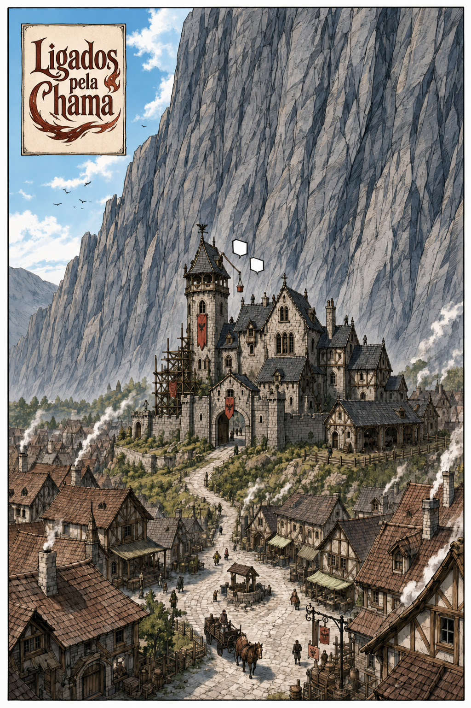
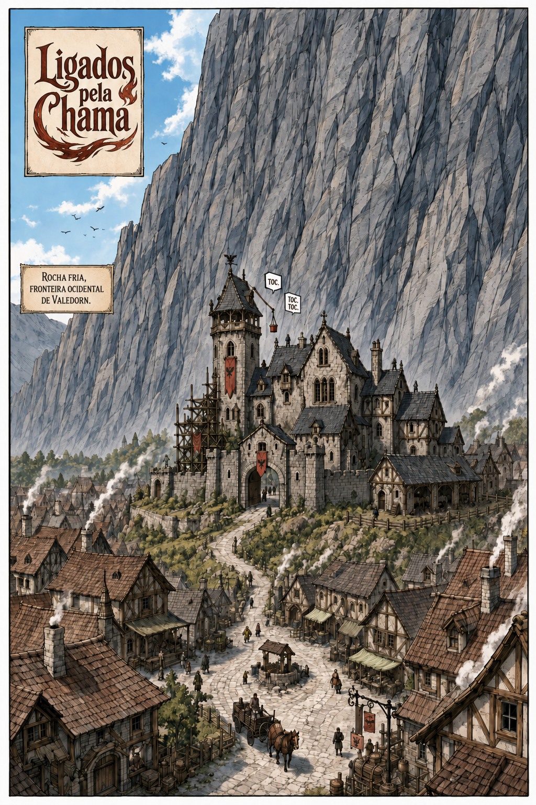

# Página 001 — A casa ao pé do impossível

- **Status:** storyboard colorido produzido; aguardando aprovação.
- **Objetivo:** apresentar Rochafria, a guilda e a Muralha de Cinza numa única imagem.
- **Horário:** manhã clara.
- **Quadros:** 1.

> O quadro de legenda permanece vazio na arte. Inserir o texto durante a diagramação.

## Quadro 1 — página inteira

Vista ampla: Rochafria em primeiro plano, o pequeno castelo gótico da Vigília do Corvo numa elevação e a Muralha de Cinza ocupando quase todo o horizonte. Pessoas, carroças e fumaça de chaminés tornam a região acolhedora. Trabalhadores aparecem como pequenas silhuetas no telhado da guilda.

**Legenda:** “Rochafria, fronteira ocidental de Valedorn.”

**Som distante:** TOC. TOC. TOC.

## Continuidade de saída

- Manhã ensolarada.
- Andaime visível na parede oeste.
- Balde vermelho no telhado.
