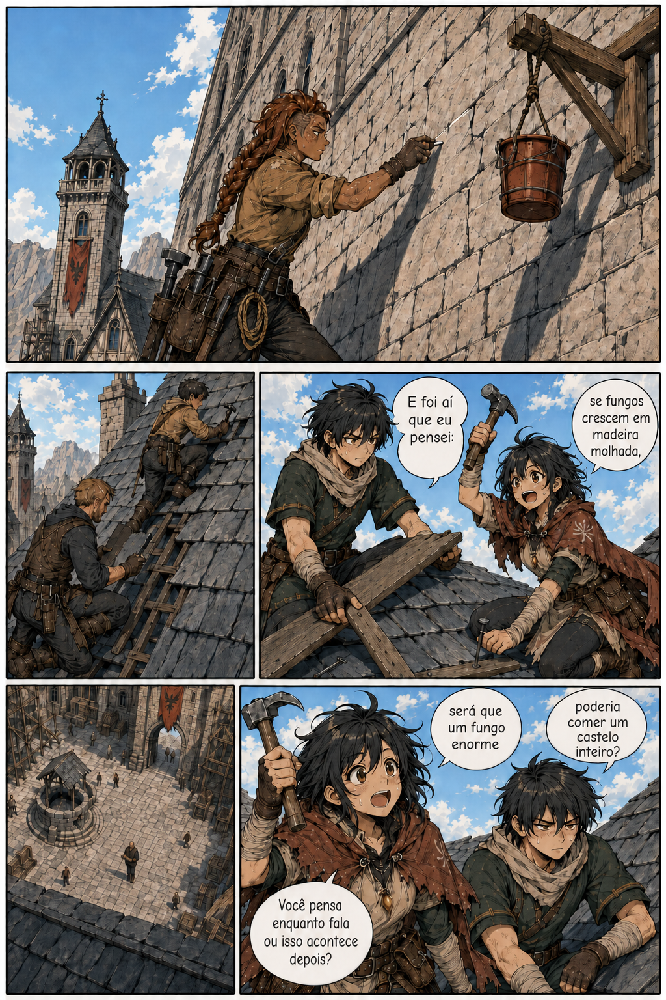

# Página 002 — Manutenção

- **Status:** storyboard colorido v4 produzido; **aguardando aprovação**.
- **Objetivo:** mostrar que a guilda é uma comunidade de trabalho.
- **Quadros:** 5.

> As versões anteriores foram preservadas como histórico. Na versão 4, Téo mantém sua paleta verde-escura, a plongée continua acentuada e Garran foi reduzido à escala dos demais adultos no pátio.

> Os balões permanecem vazios na arte. O diálogo abaixo é a referência canônica para a diagramação.

## Quadros

1. Brina examina uma rachadura e marca a pedra com giz.
2. Dois mercenários substituem telhas.
3. Téo, de túnica verde-escura, segura uma tábua enquanto Mira, de manto vermelho-terroso, tenta martelar e falar ao mesmo tempo. As duas paletas precisam se separar à primeira vista.
4. Plongée a partir do telhado: Garran atravessa o pátio sete metros abaixo, consultando uma prancheta de contratos, pequeno no enquadramento.
5. Mira levanta o martelo e continua uma história que já dura tempo demais.

**Mira:** “E foi aí que eu pensei: se fungos crescem em madeira molhada, será que um fungo enorme poderia comer um castelo inteiro?”

**Téo:** “Você pensa enquanto fala ou isso acontece depois?”

> **Altura:** Mira, Téo e os dois mercenários estão no telhado do salão, sete metros acima do pátio. Ver a regra de altura e câmera em [continuidade-local.md](../continuidade-local.md).

## Continuidade de saída

- Mira e Téo estão no telhado do salão.
- Garran está no pátio, diretamente abaixo deles.
