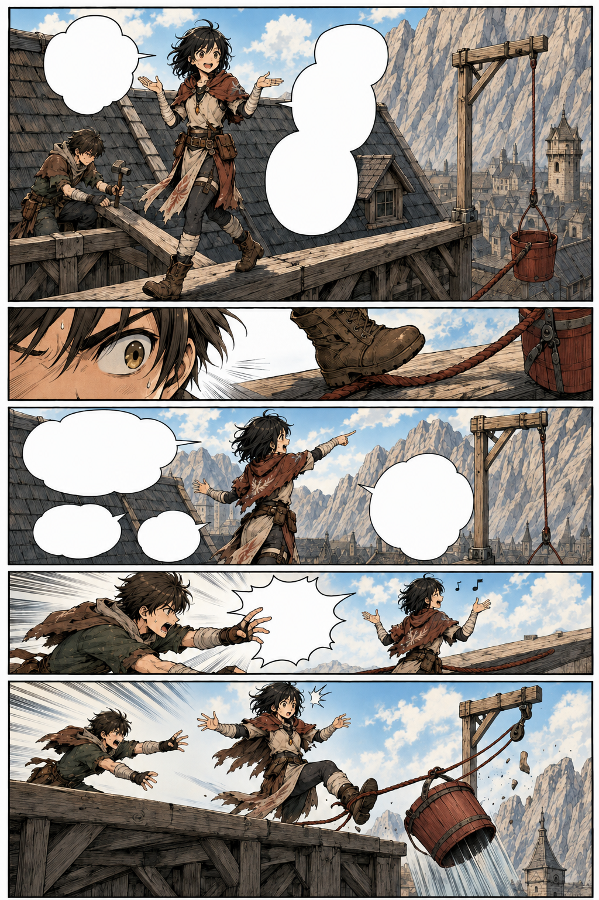
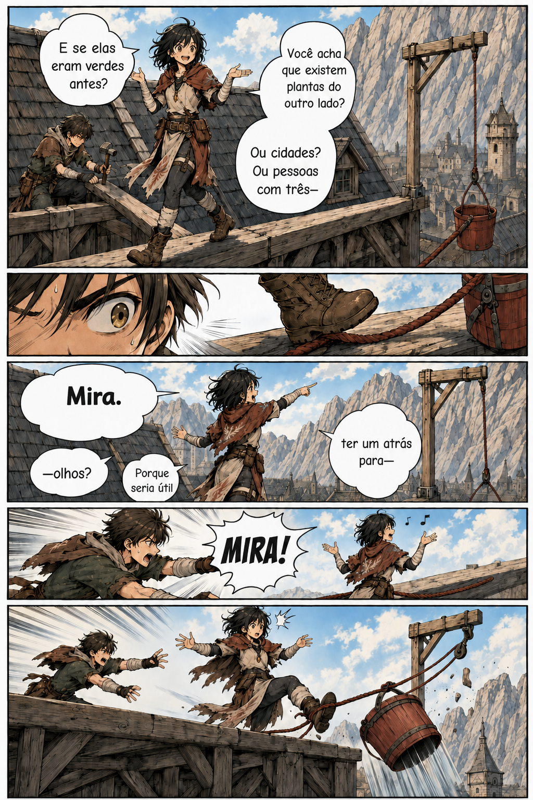

# Página 003 — Mira não para

- **Status:** storyboard colorido produzido; aguardando aprovação.
- **Objetivo:** estabelecer curiosidade, tagarelice e energia física de Mira.
- **Quadros:** 5.

> Os balões permanecem vazios na arte. O diálogo abaixo é a referência canônica para a diagramação.

## Quadros

1. Mira caminha de costas sobre uma viga enquanto fala.
2. Téo observa o pé dela se aproximando da corda do balde.
3. Mira pergunta se as montanhas sempre foram cinzentas.
4. Téo tenta interrompê-la.
5. O tornozelo de Mira prende a corda; o balde escorrega da borda.

**Mira:** “E se elas eram verdes antes? Você acha que existem plantas do outro lado? Ou cidades? Ou pessoas com três—”

**Téo:** “Mira.”

**Mira:** “—olhos? Porque seria útil ter um atrás para—”

**Téo:** “Mira!”

## Continuidade de saída

- O balde cai na direção de Garran.
- Mira ainda não percebeu.
