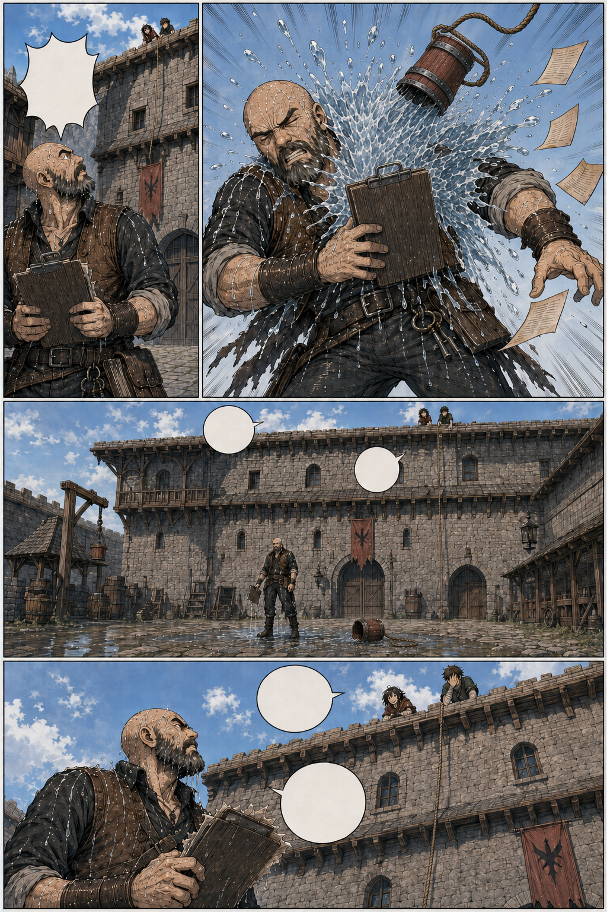
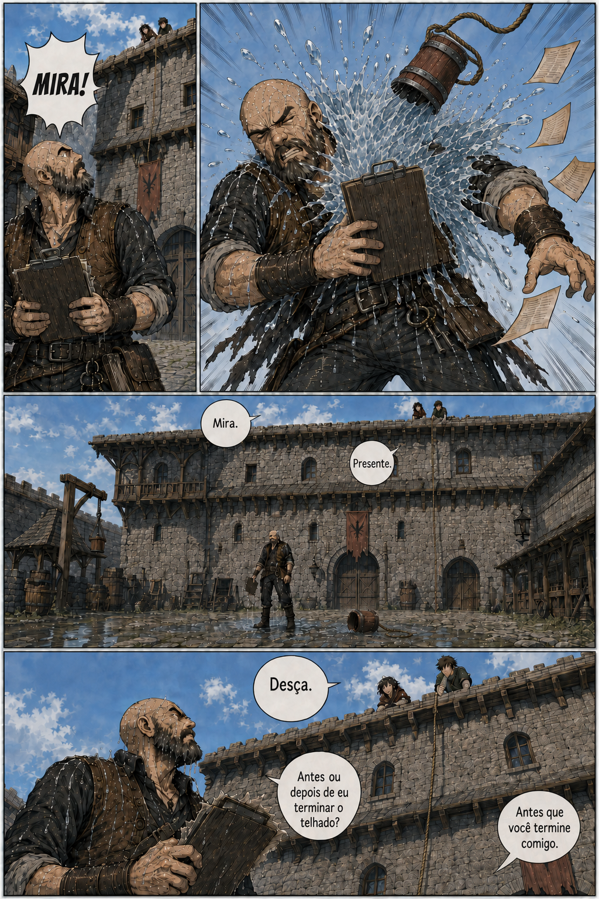

# Página 004 — O balde

- **Status:** storyboard colorido v4 produzido; **aguardando aprovação**.
- **Objetivo:** comédia física e apresentação da dinâmica entre Mira e Garran.
- **Quadros:** 4.

> As versões anteriores foram preservadas como histórico. Na versão 4, o salão mantém seus dois andares e cerca de sete metros de altura; o balde foi reduzido à escala de um balde de trabalho comum, permanece inteiro, e a água sai pela abertura.

> Os balões permanecem vazios na arte. O diálogo abaixo é a referência canônica para a diagramação.

> **Altura:** Mira e Téo estão no telhado do salão, sete metros acima do pátio. Nenhum quadro pode colocá-los ao alcance de Garran. Ver a regra de altura e câmera em [continuidade-local.md](../continuidade-local.md).

## Quadros

1. Contra-plongée. Garran no pátio, em primeiro plano baixo, ergue a cabeça ao ouvir Téo gritar. Acima e atrás dele, a parede do salão sobe até o beiral; Mira e Téo são duas silhuetas pequenas contra o céu, no alto do andaime. A distância entre eles precisa ser legível de imediato.
2. Tarde demais. O balde acerta Garran em cheio; a água explode sobre ele e as folhas de contrato voam. Câmera próxima, na altura dele — este é o único quadro da página sem o telhado no enquadramento.
3. Silêncio. Plano aberto do pátio em leve contra-plongée: Garran encharcado e imóvel no centro, o balde rolando pela pedra molhada, e o volume inteiro do salão subindo atrás dele até o telhado. Lá em cima, minúsculos na borda, Mira com um sorriso culpado e Téo cobrindo o rosto com a mão. O pátio vazio ao redor mede a queda.
4. Contra-plongée fechada, quase da altura das botas de Garran. Ele ocupa o canto inferior do quadro, olhando para cima, molhado, ainda segurando a prancheta destruída. No topo do quadro, recortados contra o céu e vistos por baixo, Mira debruçada no beiral e Téo ao lado dela. Os balões atravessam o espaço vazio entre os dois planos.

**Garran:** “Mira.”

**Mira:** “Presente.”

**Garran:** “Desça.”

**Mira:** “Antes ou depois de eu terminar o telhado?”

**Garran:** “Antes que você termine comigo.”

## Continuidade de saída

- Garran está molhado.
- A prancheta foi danificada, mas continua com ele.
- O balde é recuperado e amarrado novamente.
