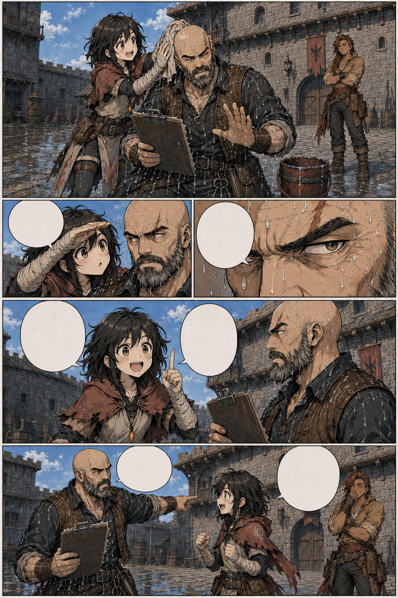
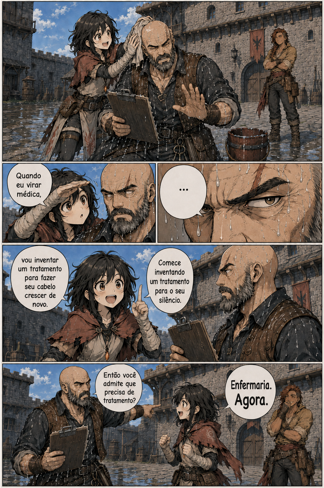

# Página 005 — A futura médica

- **Status:** storyboard colorido v1 produzido; **aguardando aprovação**.
- **Objetivo:** revelar o sonho de Mira e o afeto disfarçado de Garran.
- **Quadros:** 5.

## Quadros

1. Mira seca a cabeça de Garran com um pano enquanto ele tenta afastá-la.
2. Ela examina seriamente a careca dele como se fosse um caso médico.
3. Close de Garran perdendo a paciência.
4. Mira anuncia seu futuro tratamento.
5. Garran aponta para a enfermaria; ao fundo, Brina esconde um sorriso.

**Mira:** “Quando eu virar médica, vou inventar um tratamento para fazer seu cabelo crescer de novo.”

**Garran:** “Comece inventando um tratamento para o seu silêncio.”

**Mira:** “Então você admite que precisa de tratamento?”

**Garran:** “Enfermaria. Agora.”

## Continuidade de saída

- Mira segue para a enfermaria.
- Garran permanece com a prancheta molhada.
