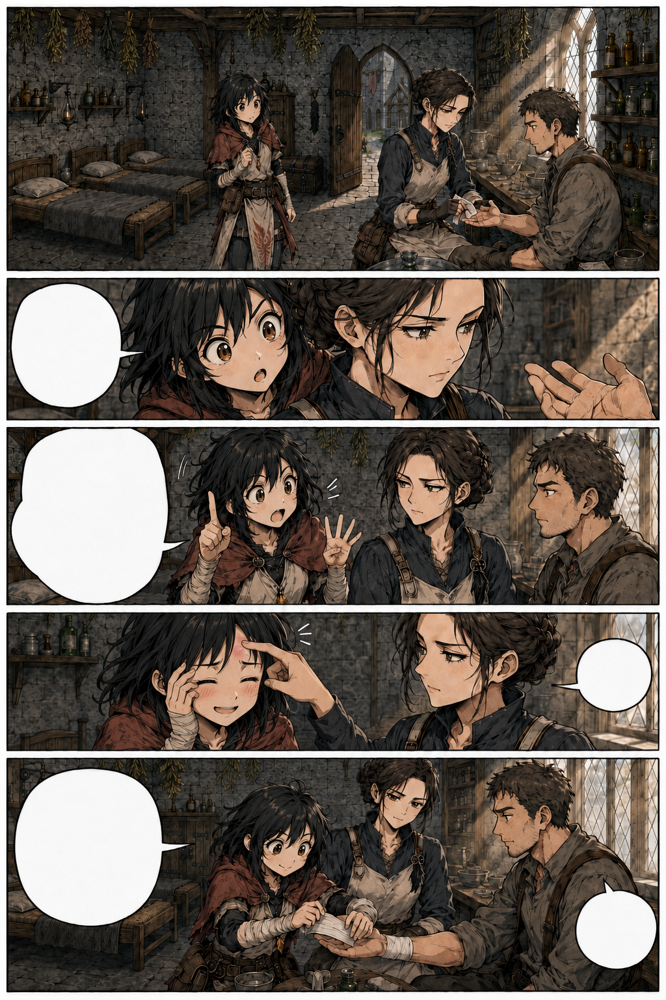
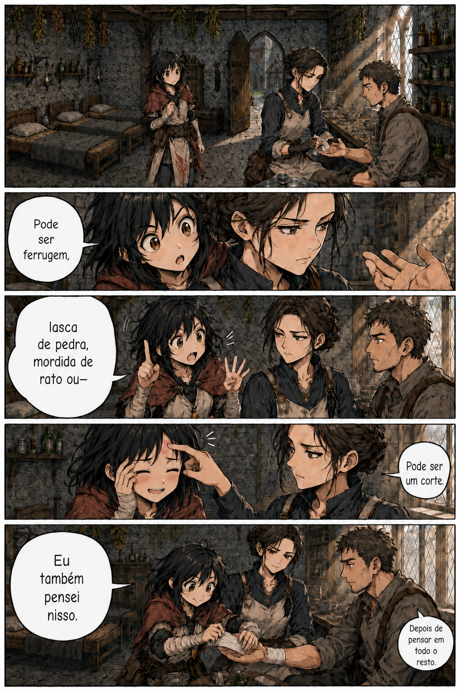

# Página 006 — Aula de Maela

- **Status:** storyboard colorido v3 produzido; prova de letreiramento v1 produzida; **aguardando aprovação**.
- **Objetivo:** fundamentar o interesse médico de Mira.
- **Quadros:** 5.

> As versões anteriores foram preservadas como histórico. Na versão 3, Maela interrompe a tagarelice com um peteleco; Mira fica com o ponto do toque avermelhado e sorri, envergonhada.

## Quadros

1. Maela limpa um corte na mão de um trabalhador.
2. Mira observa perto demais.
3. Mira oferece três diagnósticos sem respirar.
4. Maela dá um peteleco na testa de Mira; o ponto fica avermelhado e Mira sorri, envergonhada por ter falado demais.
5. Mira termina corretamente o curativo sob supervisão.

**Mira:** “Pode ser ferrugem, lasca de pedra, mordida de rato ou—”

**Maela:** “Pode ser um corte.”

**Mira:** “Eu também pensei nisso.”

**Maela:** “Depois de pensar em todo o resto.”

## Continuidade de saída

- Mira demonstra habilidade básica com curativos.
- Maela manda Mira buscar ervas em Rochafria mais tarde.
