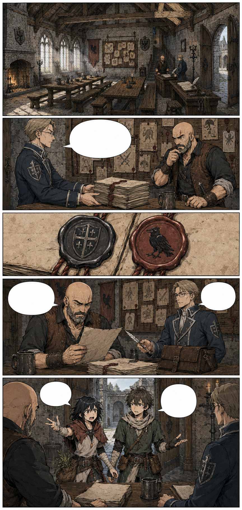
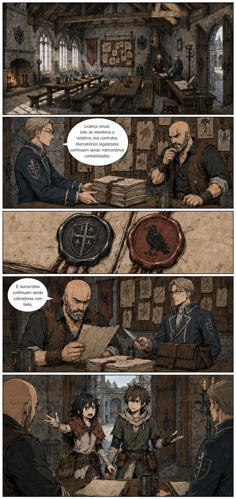

# Página 007 — Mercenários com licença

- **Status:** storyboard colorido v1 produzido; **aguardando aprovação**.
- **Objetivo:** explicar naturalmente a função legal da guilda.
- **Quadros:** 5.

## Quadros

1. Salão de contratos: quadro com escoltas, buscas e caçadas autorizadas.
2. Um escrivão de Valedorn deposita documentos diante de Garran.
3. Selo oficial do governo ao lado do símbolo do corvo.
4. Garran lê as condições de renovação com irritação.
5. Mira e Téo entram discutindo quem carregará as ervas.

**Escrivão:** “Licença anual, lista de membros e relatório dos contratos. Mercenários legalizados continuam sendo mercenários contabilizados.”

**Garran:** “E burocratas continuam sendo cobradores com tinta.”

## Continuidade de saída

- O escrivão precisa registrar os membros presentes.
- A licença atual vence em sete dias.
