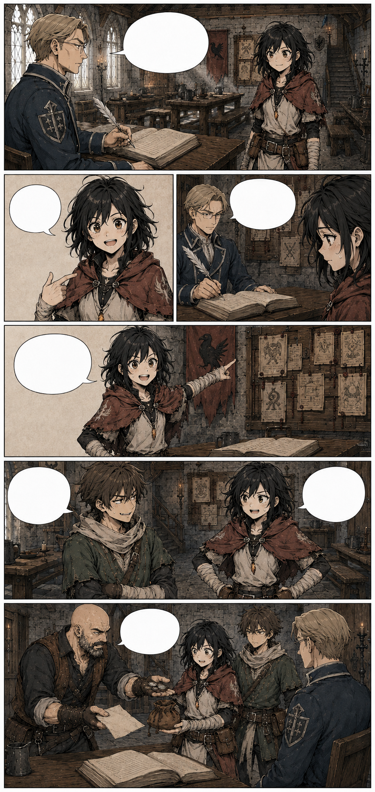
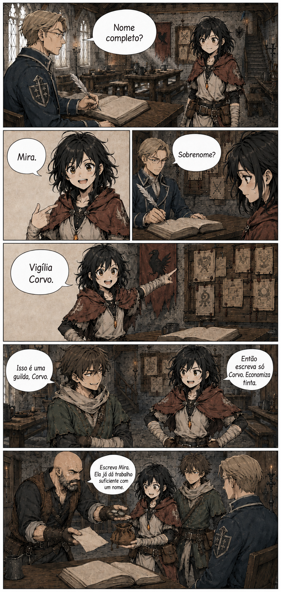

# Página 008 — Nome completo

- **Status:** storyboard colorido v1 produzido; **aguardando aprovação**.
- **Objetivo:** apresentar a ausência de sobrenome de Mira com humor e leve desconforto.
- **Quadros:** 6.

## Quadros

1. O escrivão pergunta o nome de Mira sem erguer os olhos.
2. Ela responde apenas “Mira”.
3. Ele pede o sobrenome. Pequena pausa.
4. Mira aponta para o estandarte da guilda e improvisa “Vigília Corvo”.
5. Téo a provoca; Mira rebate.
6. Garran encerra o assunto e entrega a ela a lista de compras de Maela.

**Escrivão:** “Nome completo?”

**Mira:** “Mira.”

**Escrivão:** “Sobrenome?”

**Mira:** “Vigília Corvo.”

**Téo:** “Isso é uma guilda, Corvo.”

**Mira:** “Então escreva só Corvo. Economiza tinta.”

**Garran:** “Escreva Mira. Ela já dá trabalho suficiente com um nome.”

## Subtexto

Mira ri, mas existe um instante breve em que evita olhar para os outros.

## Continuidade de saída

- Mira recebe moedas, lista e bolsa para ervas.
- Ela parte para Rochafria.
