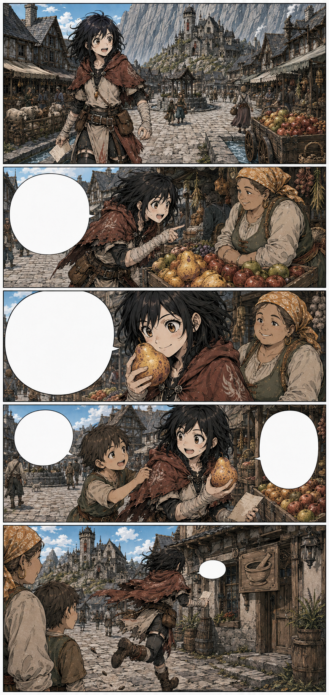

# Página 009 — Rochafria

- **Status:** storyboard colorido v1 produzido; **aguardando aprovação**.
- **Objetivo:** mostrar Mira fascinada pelo mundo cotidiano.
- **Quadros:** 5.

## Quadros

1. Mira desce a estrada em direção à cidade, com a cordilheira às costas.
2. Para diante de uma carroça de frutas vindas do leste e interroga o vendedor.
3. Cheira uma fruta desconhecida e pergunta como nasce.
4. Uma criança local a reconhece como “Mira Corvo”.
5. Mira lembra subitamente das ervas e corre para a botica.

**Mira:** “Como se chama?”

**Mira:** “Ela cresce em árvore ou embaixo da terra?”

**Criança:** “Você não tinha uma tarefa?”

**Mira:** “Tenho várias. Descobrir essa fruta acabou de virar uma delas.”

**Mira, gritando:** “As ervas!”

## Continuidade de saída

- A bolsa de ervas ainda está vazia.
- O céu permanece claro, mas o vento diminui.
