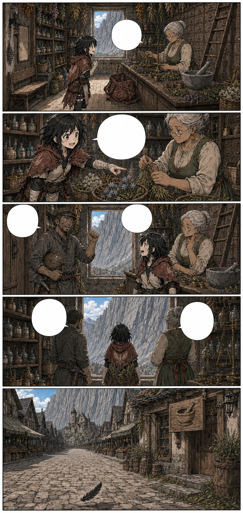
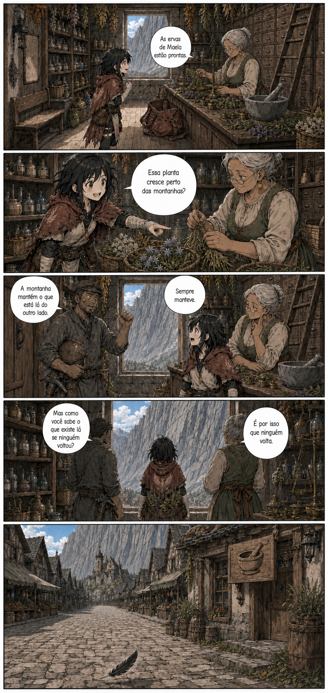

# Página 010 — A montanha protege

- **Status:** storyboard colorido v1 produzido; **aguardando aprovação**.
- **Objetivo:** estabelecer a crença na segurança da Muralha de Cinza.
- **Quadros:** 5.

## Quadros

1. Botica de Rochafria; a proprietária separa ervas para Maela.
2. Mira pergunta sobre uma planta que cresce perto das montanhas.
3. Um mineiro comenta que ninguém atravessa a Muralha.
4. Vista das montanhas pela janela da botica.
5. Uma pena de pássaro cai numa rua estranhamente vazia.

**Proprietária:** “As ervas de Maela estão prontas.”

**Mira:** “Essa planta cresce perto das montanhas?”

**Mineiro:** “A montanha mantém o que está lá do outro lado. Sempre manteve.”

**Mira:** “Mas como você sabe o que existe lá se ninguém voltou?”

**Proprietária:** “É por isso que ninguém volta.”

## Continuidade de saída

- Mira recebe a bolsa cheia de ervas.
- Os pássaros começam a desaparecer.
