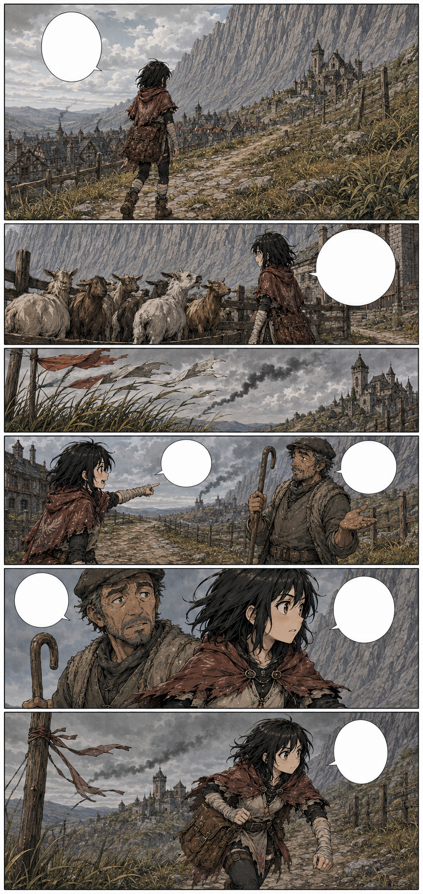
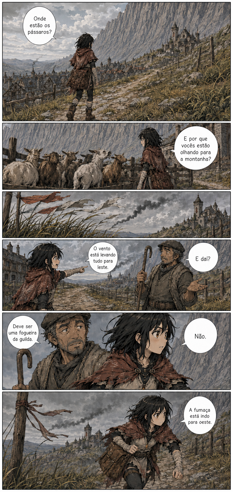

# Página 011 — O silêncio

- **Status:** storyboard colorido v1 produzido; **aguardando aprovação**.
- **Objetivo:** mudar gradualmente o tom sem revelar a ameaça.
- **Quadros:** 6.

## Quadros

1. Mira sobe a estrada de volta ao Solar e percebe que não há pássaros nos fios, telhados ou céu.
2. Cabras se comprimem contra o lado leste de uma cerca, afastando-se da Muralha e olhando para oeste.
3. Bandeirolas e capim mostram uma brisa soprando para leste, mas uma coluna fina de fumaça negra junto às montanhas se inclina para oeste.
4. Mira tenta perguntar a um pastor se aquilo é normal.
5. O pastor diz que deve ser uma fogueira da guilda.
6. Mira compara a direção das bandeirolas com a fumaça e percebe que elas se movem para lados opostos.

**Mira:** “Onde estão os pássaros?”

**Mira:** “E por que vocês estão olhando para a montanha?”

**Mira:** “O vento está levando tudo para leste.”

**Pastor:** “E daí?”

**Pastor:** “Deve ser uma fogueira da guilda.”

**Mira:** “Não.”

**Mira:** “A fumaça está indo para oeste.”

## Continuidade de saída

- O céu começa a ficar cinzento.
- Mira acelera o passo, ainda carregando as ervas.
- A fumaça permanece fina e distante; nenhum Umbral é mostrado.
