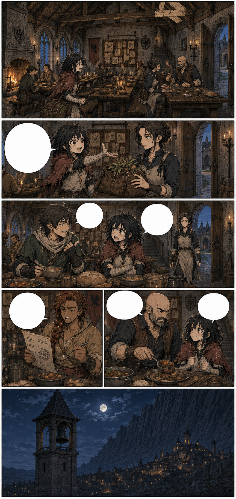
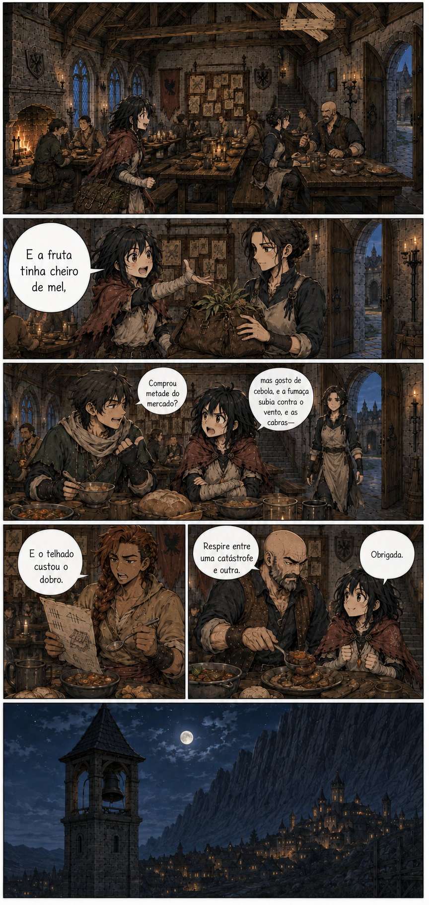

# Página 012 — Último jantar tranquilo

- **Status:** storyboard colorido v1 produzido; **aguardando aprovação**.
- **Objetivo:** mostrar a guilda como família antes do ataque.
- **Quadros:** 6.

## Quadros

1. Anoitecer no salão iluminado por lareira e velas; trabalhadores comem após os reparos.
2. Mira entrega a bolsa de ervas a Maela e começa a contar tudo que viu. Maela confere o conteúdo, sai pela porta lateral para guardá-lo e retorna antes do quadro seguinte.
3. Téo pergunta se ela comprou metade do mercado.
4. Brina reclama do custo do telhado.
5. Garran coloca discretamente uma porção maior no prato de Mira.
6. Exterior silencioso: o sino da torre permanece imóvel contra o céu já completamente noturno; nenhuma ave cruza a lua.

**Mira:** “E a fruta tinha cheiro de mel, mas gosto de cebola, e a fumaça subia contra o vento, e as cabras—”

**Téo:** “Comprou metade do mercado?”

**Brina:** “E o telhado custou o dobro.”

**Garran:** “Respire entre uma catástrofe e outra.”

**Mira:** “Obrigada.”

## Continuidade de saída

- Todos estão no salão, exceto a sentinela da torre.
- Mira está sem a bolsa; Maela a guardou na enfermaria durante o jantar.
- Noite completa.
- A prancheta de Garran não está no jantar e não volta a aparecer.
