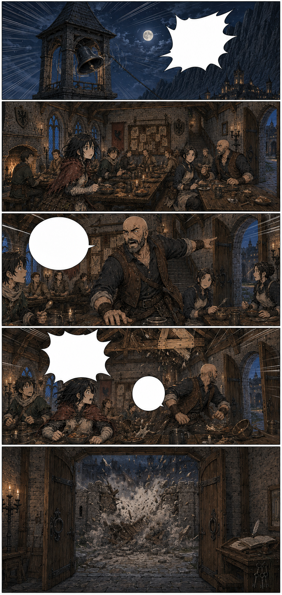
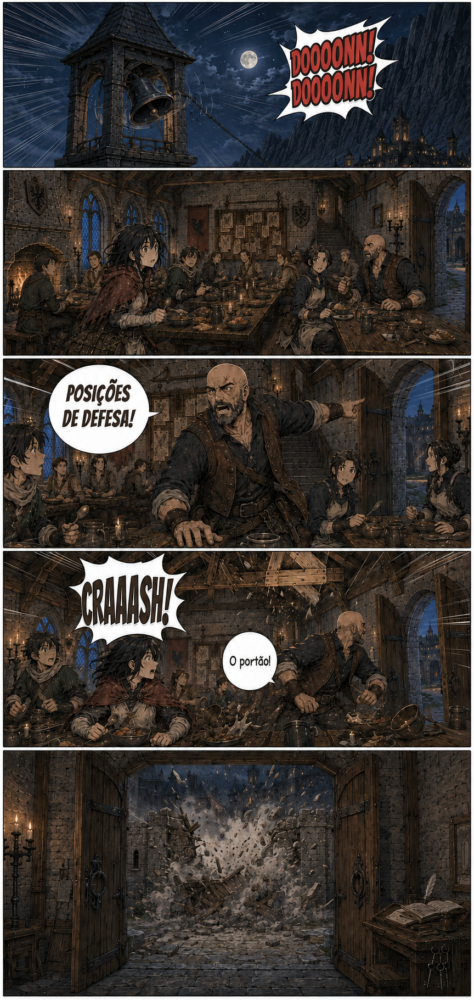

# Página 013 — O sino

- **Status:** storyboard colorido v1 produzido; prova de letreiramento v1 produzida; **aguardando aprovação**.
- **Objetivo:** romper violentamente a sensação de segurança.
- **Quadros:** 5.

## Quadros

1. Close do sino tocando com força.
2. Todos no salão congelam.
3. Garran se levanta e muda instantaneamente de figura paternal para comandante.
4. Um impacto vindo do portão sacode o castelo; poeira cai especificamente do trecho claro do teto recém-reparado.
5. Vista do salão através das portas abertas para o pátio: a tranca do portão e a alvenaria já enfraquecida ao redor cedem para dentro. O causador permanece oculto por poeira e escuridão.

**Som:** DOOOONN! DOOOONN!

**Impacto:** CRAAASH!

**Garran:** “Posições de defesa!”

**Brina:** “O portão!”

## Continuidade de saída

- Garran abandona o prato e assume o comando; ele não está com a prancheta.
- Parte da muralha externa e do portão está destruída.
- O salão fica parcialmente escuro.
- A causa exata do impacto ainda não é revelada.
