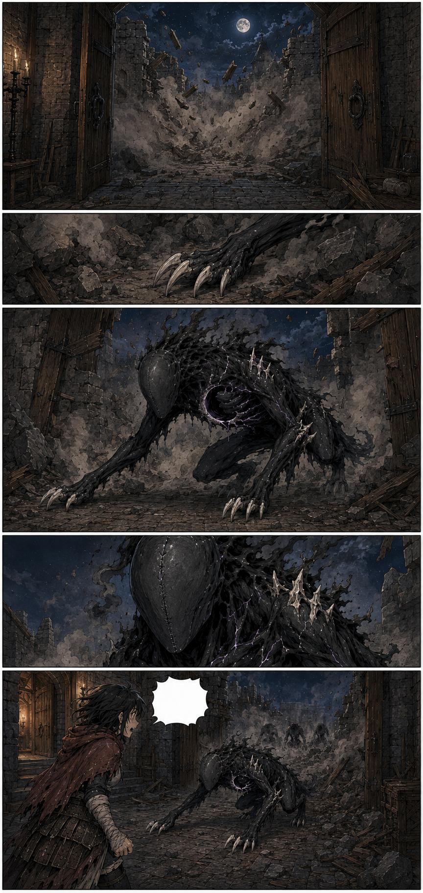
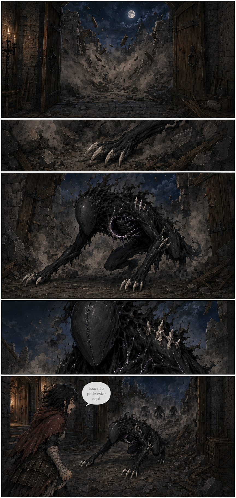

# Página 014 — O impossível atravessou

- **Status:** storyboard colorido v1 produzido; **aguardando aprovação**.
- **Objetivo:** primeira revelação de um Umbral.
- **Quadros:** 5.

## Quadros

1. Poeira, pedras e madeira cobrem a abertura junto ao portão; não há criatura grande visível.
2. Uma garra pálida surge entre as pedras.
3. O Umbral Menor emerge agachado: quadrúpede de cerca de 1,4 metro, matéria negra fosca, braços longos, garras ósseas e ferida crescente no torso com brilho violeta fraco.
4. Close no rosto liso; a boca vertical permanece fechada.
5. Mira chega ao pátio e vê a criatura. Sua curiosidade desaparece por um instante, substituída por medo.

**Mira, baixo:** “Isso não pode estar aqui.”

## Continuidade de saída

- Primeiro Umbral dentro do pátio.
- Mais silhuetas aparecem do lado de fora.
- Mira ainda não manifesta chamas.
- O Menor não deve parecer grande ou forte o bastante para ter demolido sozinho a muralha.
