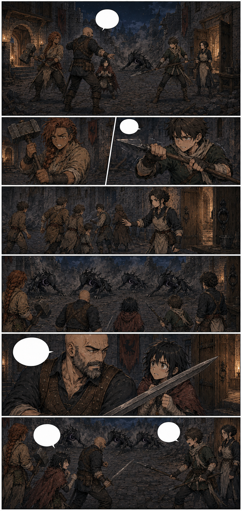
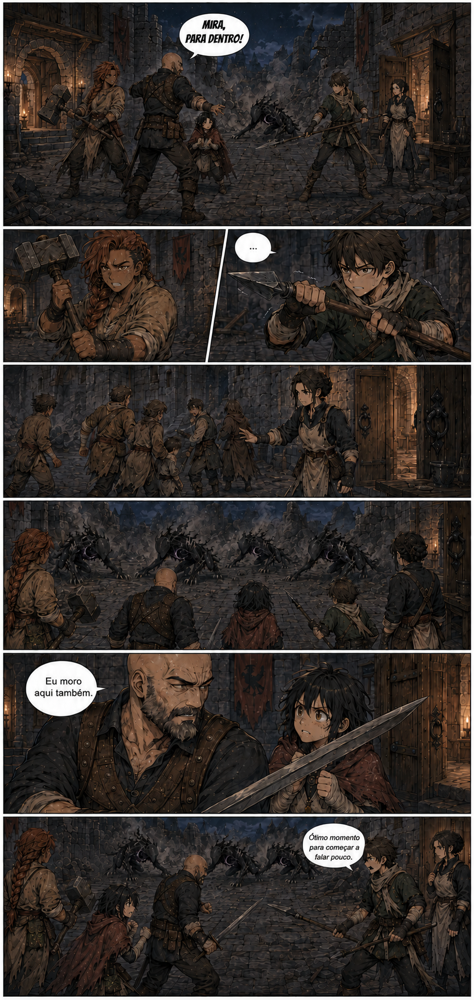

# Página 015 — A matilha

- **Status:** storyboard colorido v1 produzido; **aguardando aprovação**.
- **Objetivo:** preparar o confronto e mostrar competência da guilda.
- **Quadros:** 6.

## Quadros

1. Plano aberto do pátio fixa a defesa: Garran ao centro diante do salão, Brina à esquerda perto da brecha, Téo à direita com lança curta e Mira um passo atrás de Garran.
2. Brina firma o martelo pesado; Téo segura a lança com mãos trêmulas, mas mantém a ponta voltada para a ameaça.
3. Ao fundo, Maela conduz feridos e não combatentes pela lateral leste até a porta da enfermaria.
4. Três novos Umbrais Menores atravessam o portão danificado.
5. Garran manda Mira recuar.
6. Mira assume uma postura de combate corpo a corpo, assustada, mas incapaz de abandonar os demais.

**Garran:** “Mira, para dentro!”

**Mira:** “Eu moro aqui também.”

**Téo:** “Ótimo momento para começar a falar pouco.”

## Continuidade de saída

- Quatro Umbrais Menores visíveis.
- Todos olham para o pátio; ninguém percebe ainda o céu.
- Sem manifestação de fogo.
- A formação espacial deste quadro deve ser preservada na página 16.
