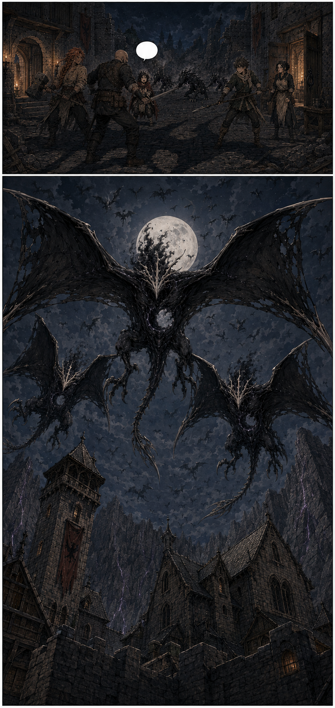
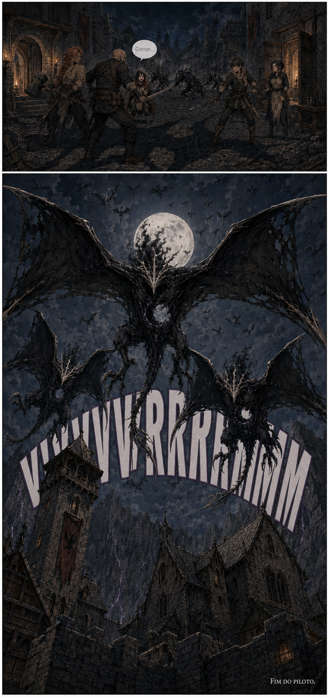

# Página 016 — O céu negro

- **Status:** storyboard colorido v1 produzido; **aguardando aprovação**.
- **Objetivo:** cliffhanger final e expansão imediata da ameaça.
- **Quadros:** 2.

## Quadro 1

Uma sombra de asas atravessa primeiro o rosto de Mira e depois engole Garran, Brina, Téo, os quatro Menores e todo o pátio. Mira interrompe a postura de combate e ergue os olhos.

**Mira:** “Garran...”

## Quadro 2 — imagem dominante

Vista de baixo para cima: três Umbrais Alados dominam o primeiro plano e dezenas de silhuetas menores descem atrás deles, cobrindo parcialmente a lua. Cada criatura possui cerca de oito metros de envergadura, cabeça sem olhos, coroa óssea, asas membranosas e cauda longa. A torre de dezoito metros, o sino e os telhados góticos fornecem escala. A Muralha de Cinza permanece ao fundo, agora marcada por rachaduras violetas distantes.

Sem diálogo. Apenas o som das asas.

**Som:** VVVVVRRRRMMM

**Texto final:** “Fim do piloto.”

## Continuidade de saída

- A batalha ainda não começou plenamente.
- Mira ainda não manifestou suas chamas.
- Umbrais Menores ocupam o pátio e Umbrais Alados cercam o castelo.
- As rachaduras violetas na cordilheira são um indício, não uma explicação.
- Míscar, Vael, Aelyra e as chamas não aparecem nem são sugeridos visualmente.
