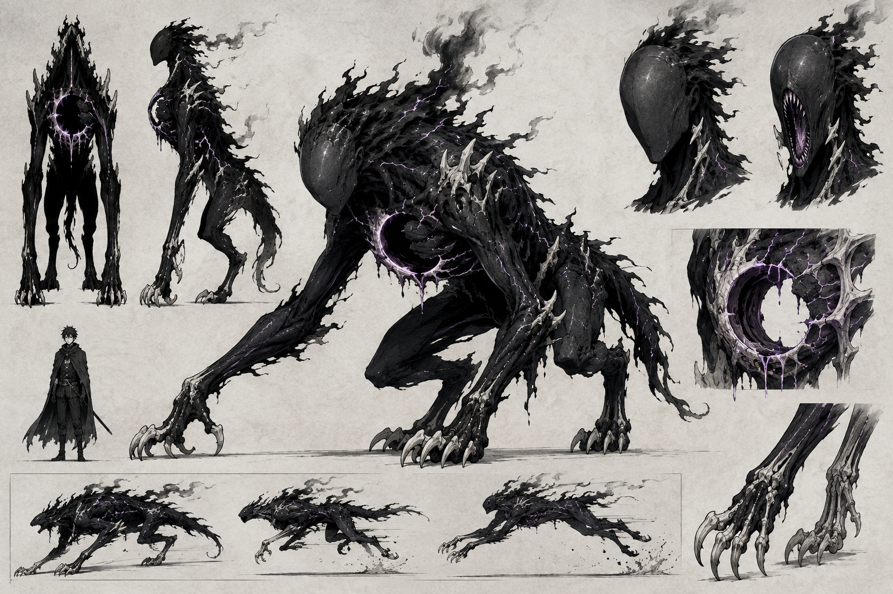
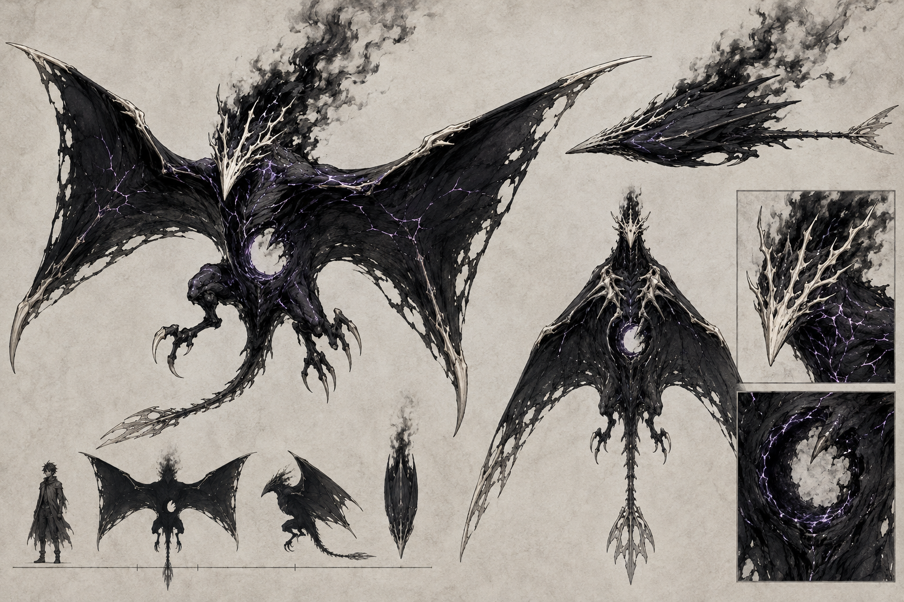
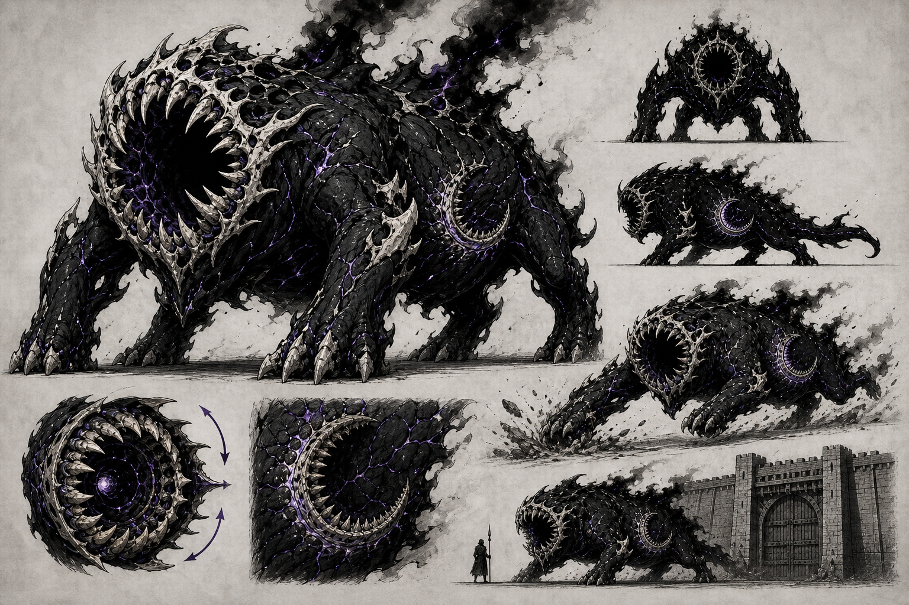
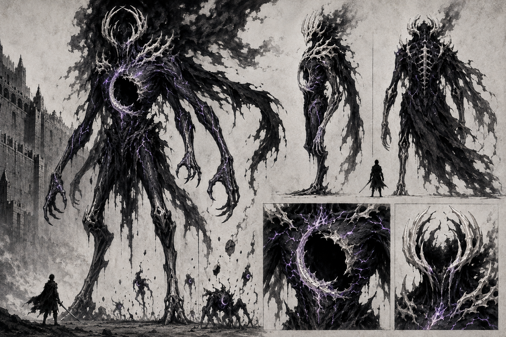

# Umbrais

> **Status:** nome, origem, relação com Ânima e cinco classes estabelecidos. As quatro artes existentes ainda aguardam aprovação visual; o Umbral Pleno ainda não possui arte.

Umbrais são criaturas geradas pela corrupção emanada do cadáver da Deusa das Sombras no Continente Negro. Não são demônios nem animais naturais, embora algumas classes imitem estruturas de seres vivos.

## Linguagem visual compartilhada — proposta

- Corpos de matéria negra fosca, semelhantes a tinta rasgada, piche resfriado e madeira carbonizada.
- Anatomia incompleta, assimétrica e aparentemente formada durante o movimento.
- Rachaduras internas com brilho violeta fraco.
- Ferida vazia em forma de crescente em alguma parte do torso.
- Estruturas semelhantes a ossos claros crescendo organicamente do corpo.
- Fumaça que sobe contra a direção do vento e da gravidade.
- Ausência de olhos convencionais.
- Silhuetas legíveis mesmo em páginas de mangá sem cor.

## Umbral Menor — proposta

- **Função:** predador comum de matilha.
- **Altura:** aproximadamente 1,4 metro quando agachado.
- **Locomoção:** quadrúpede digitígrado, capaz de se erguer brevemente sobre duas pernas.
- **Características:** braços muito longos, garras ósseas, coluna flexível e juba de matéria semelhante a tinta.
- **Comunicação:** o rosto é liso e sem olhos; a metade inferior pode se abrir numa boca vertical. Indivíduos raros conseguem imitar vozes ou formar palavras humanas.
- **Possível função no roteiro:** uma criatura desta classe pode ser a responsável por dizer a Mira que o mundo está acabando.

## Umbral Alado — proposta

- **Função:** reconhecimento, perseguição e emboscada aérea.
- **Envergadura:** aproximadamente 8 metros.
- **Locomoção:** asas membranosas largas; dobra o corpo numa forma semelhante a uma lança durante mergulhos.
- **Características:** cabeça achatada sem olhos, coroa sensorial óssea, cauda longa usada como leme e ferida crescente sob o peito.
- **Comportamento:** silencioso e observador; costuma anteceder ataques maiores.

## Umbral Devorador — proposta

- **Função:** criatura de cerco e consumo.
- **Dimensões:** aproximadamente 5 metros de comprimento e 3 metros de altura nos ombros.
- **Locomoção:** seis membros capazes de sustentar grande peso; o par dianteiro destrói muralhas e portões.
- **Características:** cabeça e peito formam uma boca circular enorme, cercada por dentes ósseos irregulares.
- **Crescimento:** torna-se maior e mais assimétrico ao consumir matéria viva e magia.
- **Comportamento:** avança até esgotar toda fonte de alimento ou poder em sua rota.

## Grande Umbral — proposta

- **Função:** entidade de categoria catastrófica.
- **Altura:** aproximadamente 40 metros.
- **Locomoção:** humanoide de quatro braços e pernas com articulações invertidas.
- **Características:** coroa óssea ao redor de uma cabeça vazia, grande cavidade crescente atravessando o peito e fraturas violetas pelo torso.
- **Manifestação:** fragmentos desprendidos de seu corpo podem formar Umbrais menores.
- **Ameaça:** uma das poucas classes fisicamente capazes de atravessar ou romper a Muralha de Cinza.

## Umbral Pleno — estabelecido, sem arte

> Classe reservada para mais adiante na história. Registrada agora para que nada a contradiga.

O topo da escala, e o único Umbral que não é um buraco.

Todo Umbral é matéria sem alma, marcada pela ferida em crescente onde deveria haver Ânima. É por isso que devoram: tentam preencher. Um Umbral que consome Ânima suficiente **fecha a ferida** — e o que possui Ânima possui forma própria.

- **Função:** duelista. Não faz cerco nem destrói regiões; caça alvos escolhidos.
- **Dimensões:** proporções humanas, entre 1,7 e 1,9 metro. Menor que o Grande Umbral e muito mais perigoso.
- **Aparência:** feições humanas recuperadas, de uma beleza errada. No lugar da ferida em crescente, uma cicatriz clara em forma de lua — marca de reconhecimento da classe.
- **Olhos:** possui olhos. Nenhuma outra classe possui. O olhar é o sinal de que se está diante de um Pleno.
- **Fala:** fluente e própria, não imitativa. Escolheu um nome para si.
- **Poder:** por possuir Ânima, manifesta poder como um usuário humano, com forma coerente com aquilo em que se tornou.
- **Origem:** consumiu a Ânima de milhares de pessoas. Constrói uma identidade com fragmentos das vidas devoradas e pode devolver vozes e lembranças do que engoliu.
- **Ameaça real:** passa por humano. Num território onde o conhecimento sobre Umbrais é proibido, ninguém tem vocabulário para identificá-lo.
- **Frequência:** pouquíssimos existiram.

**Sinal precoce:** a fala imitativa rara de alguns Umbrais Menores é o primeiro sintoma da ascensão. Um Menor que forma palavras já começou a preencher a ferida. Isso permite plantar a classe cedo sem revelá-la.

### Falso coração — proposta de funcionamento

Um Pleno não passa a produzir Ânima como um ser vivo. Ele comprime a força roubada num falso coração próximo à antiga ferida. A reserva é enorme, mas finita, e sustenta sua forma humana e sua manifestação de poder. A cicatriz lunar é a marca externa dessa estrutura.

O Umbral falante do início não deve estar ascendendo por coincidência. A hipótese de trabalho é que Míscar o alimentou e o conduziu até o Solar como teste, mensageiro ou parte de um cultivo deliberado.

## Hierarquia provisória

| Classe | Frequência | Inteligência | Ameaça principal |
|---|---:|---:|---|
| Umbral Menor | Comum | Animal; rara fala imitativa | Matilhas e infiltração |
| Umbral Alado | Incomum | Tática | Reconhecimento e ataque aéreo |
| Umbral Devorador | Raro | Instintiva | Cerco e consumo de magia |
| Grande Umbral | Excepcional | Desconhecida | Destruição regional |
| Umbral Pleno | Pouquíssimos | Humana e articulada | Infiltração e duelo |

## Questões para aprovação

- A ferida crescente deve aparecer em todos os Umbrais?
- O brilho violeta representa energia da Deusa das Sombras ou influência de Míscar?
- Míscar sabe que alimentar matilhas produz Plenos? Se souber, os ataques a povoados deixam de ser caos e viram criação deliberada.
- O falso coração é destruído fisicamente ou precisa ser esvaziado de Ânima?
- Grandes Umbrais possuem consciência ou funcionam como extensões do cadáver divino?

> **Resolvido:** o Umbral que fala com Mira é um Menor a meio caminho da ascensão, não uma classe própria.
