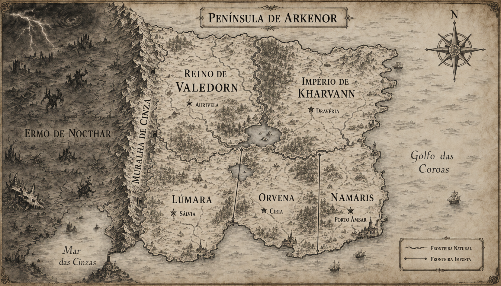

# Mapa e geografia

> **Status:** segunda versão canônica. O nome Península de Arkenor, a estrutura geopolítica e a representação visual do mapa v2 são estabelecidos; os demais nomes próprios ainda são provisórios.

## Conceito central — estabelecido

A Península de Arkenor possui aproximadamente o tamanho da Península Ibérica e é dividida em cinco países. As potências militares do norte, Valedorn e Kharvann, subjugaram os três países meridionais: Lúmara, Orvena e Namaris.

As fronteiras antigas das potências acompanham rios, serras, florestas e bacias hidrográficas. Já as fronteiras impostas aos territórios dominados foram traçadas com régua. Elas atravessam lagos, aldeias, rotas ancestrais e regiões culturais, criando conflitos que não existiam antes da conquista.

A oeste, uma cordilheira contínua separa toda a península do Ermo de Nocthar, conhecido popularmente como Continente Negro. É uma terra desolada e infestada de monstros. Segundo o conhecimento público, ninguém que atravessou as montanhas retornou.

## Visão geral

| Região | Capital | Posição | Condição política | Fronteiras |
|---|---|---|---|---|
| Reino de Valedorn | Aurivela | Norte e oeste | Potência militar | Rios, montanhas e divisores de água |
| Império de Kharvann | Dravéria | Norte e leste | Potência militar | Rios, florestas, serras e litoral |
| Lúmara | Sálvia | Sudoeste | País subjugado | Linhas impostas e litoral |
| Orvena | Círia | Sul central | País subjugado | Linhas impostas em ambos os lados |
| Namaris | Porto Âmbar | Sudeste | País subjugado | Linha imposta a oeste e litoral |

## Reino de Valedorn — provisório

Uma monarquia militar terrestre, protegida pela Muralha de Cinza e favorecida por vales férteis. Sua legitimidade se baseia na antiguidade de suas fortalezas, no controle dos passos montanhosos e numa tradição de cavaleiros ligados à magia.

**Capital: Aurivela.** Cidade fortificada construída no encontro de dois rios. Sede da corte, de arsenais rúnicos e de uma academia dedicada à magia aplicada à guerra.

**Coração Cinzento — estabelecido:** Aurivela foi erguida sobre o ponto de comando subterrâneo da Muralha de Cinza. Ali as forças antigas da Luz e das Trevas permanecem equilibradas, tornando a capital o único local capaz de sustentar o ritual de criação de um novo deus.

O [mapa urbano de Aurivela v1](../imagens/mapa/valedorn/aurivela/aurivela-mapa-urbano-v1.md) é canônico. Estabelece uma cidade de pontes dividida entre Cidade Baixa, Distrito dos Arsenais, Cidade da Coroa e Anel Interditado, cercada por três círculos defensivos irregulares e construída sobre galerias antigas que convergem para o Coração Cinzento.

### Ponte-Régia — estabelecida

Ponte-Régia é uma cidade fortificada sobre o grande rio de fronteira com Kharvann. Oficialmente funciona como centro comercial e alfandegário. Secretamente, agentes das duas potências negociam pedra saturada de Ânima e tecnologia de selos artificiais, usando o movimento de caravanas e embarcações para ocultar cargas e encontros.

O [mapa urbano de Ponte-Régia v1](../imagens/mapa/valedorn/ponte-regia/ponte-regia-mapa-urbano-v1.md) é canônico. Estabelece a Ponte das Duas Coroas, alfândegas fortificadas separadas, o Mercado da Fronteira, o Bairro dos Armazéns e uma rede clandestina sob o rio que converge para a Câmara Selada.

As [Duas Margens](guildas/valedorn.md) são uma guilda conjunta de Valedorn e Kharvann ligada à cidade, encarregada de escoltas, espionagem e controle da fronteira. Sua corrupção e dependência de propinas são estabelecidas. Sua sede canônica fica fora da cidade e ocupa as duas margens, com alas fortificadas ligadas por uma travessia privativa.

### Campodouro — estabelecida

Campodouro é a principal cidade agrícola do Vale de Aurivela. Seus celeiros imensos armazenam a produção regional, e os festivais da colheita celebram a fartura do vale. Essa prosperidade contrasta com os impostos cobrados para sustentar a ocupação do sul.

O [mapa urbano de Campodouro v1](../imagens/mapa/valedorn/campodouro/campodouro-mapa-urbano-v1.md) é canônico. Estabelece a organização geral da cidade e os nomes Praça da Colheita, Celeiros da Coroa, Casa do Dízimo, Mercado dos Campos, Moinhos do Vale, Portão do Sul, Estrada de Aurivela e Estrada do Sul.

### Pedra-Mansa — estabelecida

Pedra-Mansa é um povoado construído ao redor de um nó antigo da Muralha. Pessoas e animais dormem melhor perto dele sem saber por quê. Quando o nó é substituído por um selo artificial, começam pesadelos, frio persistente e mortes inexplicáveis.

O [mapa urbano de Pedra-Mansa v1](../imagens/mapa/valedorn/pedra-mansa/pedra-mansa-mapa-urbano-v1.md) é canônico. Representa o mesmo povoado antes e depois da substituição e estabelece seu traçado geral, o Nó Antigo, o Selo Artificial e os efeitos visíveis da ruptura.

Valedorn participou, ao lado de Kharvann, da conquista conjunta do sul. Exerce maior influência sobre Lúmara e divide o controle de Orvena com o império. Apresenta a ocupação como uma missão de proteção contra Nocthar.

### Rochafria e a Vigília do Corvo

Rochafria é uma pequena cidade situada no pé da Muralha de Cinza. Nas proximidades, a Vigília do Corvo mantém sua sede num pequeno castelo gótico chamado Solar da Vigília. A guilda atua como companhia de mercenários legalizada pelo governo de Valedorn.

A Vigília é a última guilda ativa da Marca Cinzenta. Seu nome preserva o antigo costume montanhês de nomear guildas em homenagem a animais locais e se refere diretamente ao Corvo-cinzento de olhos vermelhos.

### Fortalezas e guildas da Muralha — estabelecido

Valedorn ergueu fortalezas ao longo da Muralha de Cinza para proteger o reino de uma ameaça que, durante gerações, pareceu nunca chegar. A longa ausência de invasões transformou a defesa ocidental em símbolo de um perigo considerado antigo, exagerado ou encerrado. Parte das fortalezas foi desativada e outras continuaram operando com guarnições reduzidas.

O mesmo processo afetou as guildas próximas das montanhas. Durante cerca de mil anos de aparente segurança, todas as demais guildas montanhesas desapareceram ou deixaram de funcionar como guildas. A Vigília do Corvo sobreviveu, mas recebeu cada vez menos atenção, contratos, recursos e prestígio, enquanto companhias do interior e das fronteiras politicamente ativas passaram a concentrar investimentos e oportunidades. Essa negligência ajuda a explicar por que os primeiros sinais da falha da Muralha não recebem resposta proporcional do reino.

O [rascunho das principais guildas de Valedorn](guildas/valedorn.md) registra a estrutura inicial de Último Bastião, Duas Margens, Foice Dourada, Sentinelas do Lago Partido e Vigília do Corvo.

A quantidade, a posição, os nomes e o estado individual das fortalezas ainda serão definidos. O [mapa regional de Valedorn v4](../imagens/mapa/valedorn/regional/valedorn-regional-v4.md) representa a proposta visual vigente, escolhida pelo autor entre as composições com o Lago Partido, Kharvann, Lúmara e Orvena.

O [mapa de Rochafria e da Marca Cinzenta v1](../imagens/mapa/valedorn/rochafria-marca-cinzenta/rochafria-marca-cinzenta-v1.md) aproxima a região da Vigília e propõe trilhas, cursos d'água, ruínas defensivas e uma estrada mantida em direção a Aurivela.

## Império de Kharvann — provisório

Potência marítima e imperial do nordeste. Possui a maior frota da península e controla boa parte do comércio no Golfo das Coroas. Sua aristocracia militar emprega magos como oficiais, navegadores e engenheiros de cerco.

**Capital: Dravéria.** Metrópole de pedra escura próxima à costa, ligada a portos militares e estaleiros encantados.

Kharvann participou, ao lado de Valedorn, da conquista conjunta do sul. Exerce maior influência sobre Namaris e divide o controle de Orvena com o reino. Os dois mantêm uma paz armada e governos fantoches nos três países conquistados.

## Lúmara — provisório

País do sudoeste, entre as montanhas e o mar. Suas comunidades existiam dos dois lados da atual fronteira com Orvena; a divisão colonial separou famílias, bosques sagrados e rotas de pastoreio.

**Capital: Sálvia.** Cidade de jardins murados, curandeiros e antigos santuários. Seu governo fantoche é aprovado pelos conquistadores, mas a cidade abriga redes de resistência.

## Orvena — provisório

O território mais artificial da península: um corredor central criado para separar Lúmara de Namaris e servir de zona amortecedora entre as duas potências. Suas fronteiras retas cortam o Lago Partido, florestas e uma estrada anterior à conquista.

**Capital: Círia.** Cidade interior escolhida como capital por estar perto das linhas de ocupação. Seu governo fantoche precisa conciliar ordens das duas potências. Cresceu ao redor de um forte e tornou-se centro burocrático, mercado negro e ponto de encontro de refugiados.

## Namaris — provisório

País costeiro do sudeste, rico em portos, sal, pesca e rotas para além da península. Sua fronteira ocidental foi traçada por Kharvann para garantir que os melhores portos permanecessem sob uma única administração.

**Capital: Porto Âmbar.** Grande cidade mercantil e naval. Seu governo fantoche mantém a aparência de autonomia. A riqueza aparente convive com impostos imperiais, contrabando e ressentimento contra Kharvann.

## Marcos geográficos

### Muralha de Cinza

Cordilheira que percorre a fronteira ocidental de norte a sul. Picos altos, tempestades mágicas e poucos desfiladeiros tornam a travessia quase impossível. Fortalezas de Valedorn vigiam os passos conhecidos, mas ruínas anteriores aos cinco países sugerem que a barreira pode ter sido construída ou alterada por magia.

**Natureza verdadeira — estabelecida:** a Muralha é a própria cadeia de montanhas transformada pelos generais sobreviventes num organismo mágico depois da derrota de Vael. Luz e Sombra sobrepostas produzem uma pulsação neutra, a “cinza”, que desfaz a anti-Ânima dos Umbrais. Veios de pedra saturada funcionam como reservas; runas e fortalezas antigas, como nós do sistema. Umbrais Plenos podem enganar parcialmente a barreira porque carregam Ânima roubada.

### Ermo de Nocthar — o Continente Negro

Região além das montanhas. O solo parece queimado, a vegetação é retorcida e criaturas enormes são avistadas das torres fronteiriças. Nenhuma expedição reconhecida retornou. Histórias contraditórias falam de cidades mortas, de uma noite permanente e de fogueiras vistas a distâncias impossíveis.

### Lago Partido

Grande lago situado na transição entre os países do norte e do sul. Tratados de conquista e linhas retas o dividiram entre diferentes administrações. Povos ribeirinhos precisam de autorizações para pescar em águas que seus antepassados tratavam como território comum.

As Sentinelas do Lago Partido mantêm uma fortaleza flutuante, parcialmente submersa, capaz de subir o rio que desemboca no lago. Ela vigia as águas fronteiriças diante de Lúmara e Orvena, sem representar soberania de Valedorn sobre o lago inteiro. A [concept art v1 do castelo](../imagens/concept-art/guildas/valedorn/sentinelas-do-lago-partido/castelo-sentinelas-lago-partido-v1.md) é sua referência visual canônica. Limites e regras de patrulha permanecem a definir.

### Golfo das Coroas

Águas orientais disputadas por mercadores e frotas de Kharvann. O nome se refere às antigas coroas costeiras absorvidas pelo império.

### Mar das Cinzas

Mar ocidental, frio e perigoso. Cinzas vindas de Nocthar às vezes cobrem suas águas, mesmo quando os ventos sopram na direção contrária.

## Fronteiras e consequências

- A fronteira Valedorn–Kharvann acompanha um grande rio e o lago central. Ilhas e mudanças no curso do rio alimentam disputas.
- A linha Lúmara–Orvena separa comunidades culturalmente próximas e divide o Lago Partido.
- A linha Orvena–Namaris atravessa uma floresta ancestral e ignora completamente o relevo.
- As fronteiras artificiais permitem que as potências controlem estradas, água, minério e portos por meio de tratados feitos sem participação dos povos locais.
- Postos de fiscalização e documentos de passagem transformam deslocamentos cotidianos em atos políticos.

## Ânima, ocupação e geografia — estabelecido

- Pedra saturada de Ânima é extraída nas regiões meridionais próximas à Muralha.
- Os trabalhadores das minas apresentam mãos frias, pulso lento e esgotamento persistente porque o minério drena sua Ânima.
- Valedorn e Kharvann exportam o minério e o utilizam para substituir selos antigos da Muralha por versões artificiais mais baratas.
- Os selos artificiais não funcionam corretamente. A ocupação e a exploração do sul são a causa direta do enfraquecimento da barreira.
- A mineração remove reservas naturais da própria Muralha, e os substitutos artificiais não conseguem acompanhar seu ritmo. As falhas resultantes tornam acessíveis as prisões dos generais e permitem que Míscar atravesse a rede.
- As duas potências confiscam relatórios sobre travessias de Umbrais e sustentam publicamente que a cordilheira permanece inviolável.
- Durante quinze anos, Vael alimentou rivalidades, guerras, ocupação e decisões de exploração por projeções, agentes e conselhos falsos. As nações conservaram poder de escolha e responsabilidade, mas ele organizou as pressões que aceleraram seu enfraquecimento.

## Alta magia e geografia — propostas remanescentes

- Rios próximos das montanhas carregam resíduos de Ânima usados na produção de ferramentas, selos ou armas.
- O Lago Partido pode cobrir uma antiga cidade ou fonte de poder, explicando o interesse das duas potências.
- A versão oficial diz que monstros tentam entrar na península; talvez as fortalezas existam também para impedir que habitantes descubram o que há além delas.

## Ganchos narrativos

1. Criaturas atravessam a Muralha de Cinza, contrariando séculos de certeza.
2. Uma seca altera o rio que marca a fronteira das potências e quase inicia uma guerra.
3. Uma criatura surge no Lago Partido, exatamente onde as três administrações recusam responsabilidade.
4. Um mapa anterior à conquista prova que as fronteiras do sul foram desenhadas para dividir deliberadamente um mesmo povo.
5. Documentos provam que os selos artificiais alimentados por minério do sul estão enfraquecendo a Muralha de Cinza.

## Camadas da conspiração por país — estrutura estabelecida

1. **Valedorn — negação:** relatórios confiscados provam que o Estado já conhecia travessias anteriores.
2. **Lúmara — custo humano:** Mira reconhece nos mineiros os sintomas de exaustão de Ânima.
3. **Orvena — colusão:** no vazio jurisdicional do Lago Partido, Valedorn e Kharvann cooperam em segredo.
4. **Namaris — finalidade:** os portos revelam o destino do minério e a substituição fracassada dos selos.
5. **Kharvann — origem:** uma ordem ligada a um Grande General da Luz preserva a história verdadeira da guerra e do primeiro selo de Aelyra.

## Questões em aberto

- Quanto tempo passou desde a conquista?
- A população acredita que Nocthar é realmente desabitado?
- Qual é a relação entre a “chama” do título e a magia presente na geografia?

## Histórico visual

- `../imagens/referencias/esboco-mapa-original.png`: esboço fornecido pelo autor.
- `../imagens/mapa/peninsula-de-vhaleria-v1.png`: versão histórica com o nome provisório substituído.
- `../imagens/mapa/peninsula-de-arkenor-v2.png`: versão visual canônica e vigente do mapa da Península de Arkenor.
- `../imagens/mapa/valedorn/regional/valedorn-regional-v1.png`: versão histórica; a margem oriental parecia litoral em vez da fronteira fluvial com Kharvann.
- `../imagens/mapa/valedorn/regional/valedorn-regional-v2.png`: versão histórica; mostra Kharvann em terra firme, mas posiciona incorretamente o Lago Partido dentro de Valedorn.
- `../imagens/mapa/valedorn/regional/valedorn-regional-v3.png`: versão histórica; tentativa de simplificar o rio fronteiriço, preterida pelo autor.
- `../imagens/mapa/valedorn/regional/valedorn-regional-v4.png`: proposta visual vigente; recupera a primeira composição com o Lago Partido, Lúmara e Orvena, preferida pelo autor.
- `../imagens/mapa/valedorn/aurivela/aurivela-mapa-urbano-v1.png`: referência visual canônica do mapa urbano da capital e de seu subsolo antigo.
- `../imagens/mapa/valedorn/ponte-regia/ponte-regia-mapa-urbano-v1.png`: referência visual canônica da cidade fronteiriça, da ponte-cidadela e da rota clandestina inferior.
- `../imagens/mapa/valedorn/campodouro/campodouro-mapa-urbano-v1.png`: referência visual canônica da principal cidade agrícola do Vale de Aurivela, com seus grandes celeiros, festival da colheita e comboios tributários.
- `../imagens/mapa/valedorn/pedra-mansa/pedra-mansa-mapa-urbano-v1.png`: referência visual canônica de Pedra-Mansa antes e depois da substituição do nó antigo por um selo artificial.
- `../imagens/mapa/valedorn/rochafria-marca-cinzenta/rochafria-marca-cinzenta-v1.png`: proposta visual local de Rochafria, do Solar da Vigília e das antigas defesas da Marca Cinzenta.
