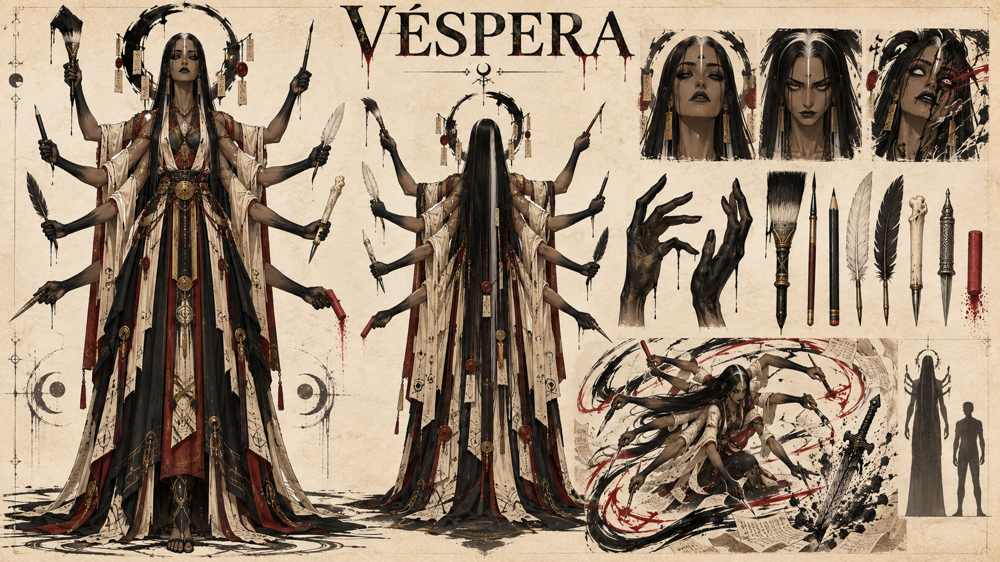

# Véspera, a Guardiã dos Nomes

> **Status:** nome, título, identidade feminina, afiliação à Deusa das Sombras, morte definitiva, múltiplos braços dispostos como os de uma aranha, poder extraído dos nomes, capacidade de reescrevê-los e uso de instrumentos de escrita como armas estabelecidos. Quantidade exata de braços, regras detalhadas, aparência, personalidade, história e morte específica permanecem como propostas. A concept art v1 é referência de trabalho aguardando aprovação.

## Identidade estabelecida

- **Nome:** Véspera.
- **Título:** Guardiã dos Nomes.
- **Afiliação:** Deusa das Sombras.
- **Identidade:** feminina.
- **Anatomia:** possui vários braços humanos abertos ao redor do corpo numa disposição semelhante à de uma aranha.
- **Domínio:** extrai poder dos nomes das coisas e consegue reescrever nomes.
- **Armas:** pincéis, lápis, penas, estiletes e outros instrumentos capazes de escrever ou gravar.
- **Estado atual:** morta definitivamente e incluída entre os nove Grandes Generais mortos.

## Função original — proposta

Véspera protegia os nomes para impedir que identidade, memória e autoridade fossem separadas de quem as construiu. Registrava nomes de povos, lugares, criaturas, armas e pactos, preservando a diferença entre nomear algo e possuir aquilo que foi nomeado.

Ela não teria criado todos os nomes do mundo. Atuava como guardiã do vínculo entre uma coisa, a forma como ela se reconhece e a maneira como é reconhecida pelos outros.

## Domínio — parte estabelecida e regras propostas

A **Escritura Nominal** permite a Véspera enxergar nomes como inscrições sobre matéria e Ânima. Um nome não é apenas uma palavra: concentra uso, memória, reputação, função e reconhecimento.

Quanto mais seres reconhecem um nome e quanto mais tempo ele existe, maior é seu **peso nominal**. Véspera pode extrair Ânima desse peso para fortalecer uma manifestação ou usar seus instrumentos para alterar a inscrição.

- Pode apagar o nome de uma arma e enfraquecer as propriedades associadas à sua história.
- Pode acrescentar um novo título a um objeto e forçá-lo temporariamente a cumprir essa função.
- Pode devolver a uma ruína um nome anterior e fazer parte de sua antiga estrutura reaparecer.
- Pode riscar o nome de uma porta e fazê-la perder a função de passagem.
- Pode transferir para si um título de combate e reproduzir a autoridade ou técnica associada a ele.
- Pode ferir uma pessoa ao separar seu nome da maneira como a própria Ânima se reconhece.

Objetos oferecem pouca resistência. Seres vivos resistem por meio da identidade, das lembranças e dos vínculos com outras pessoas. Véspera não consegue transformar instantaneamente qualquer criatura em qualquer coisa apenas escrevendo uma palavra arbitrária. Quanto maior a contradição entre o nome novo e o alvo, maior o custo e mais breve o efeito.

Uma alteração permanente em alguém exige que o alvo aceite o novo nome, que outras pessoas passem a reconhecê-lo ou que Véspera destrua os vínculos que sustentavam o nome anterior.

## Custo — proposta

Toda reescrita usa o próprio nome de Véspera como tinta invisível. Pequenas alterações apagam lembranças superficiais que outras pessoas possuem dela. Mudanças profundas removem títulos, relações e fragmentos de sua identidade.

Por isso ela registra obsessivamente o próprio nome em roupas, armas e paredes. Essas inscrições não restauram o que foi perdido, mas oferecem referências para que consiga reconstruir uma versão de si mesma.

## Manifestação máxima — proposta

No **Palimpsesto do Mundo**, Véspera abre os braços e transforma o campo numa página sobreposta à realidade. Nomes surgem sobre pessoas, lugares, armas, direções e relações. Seus oito instrumentos escrevem ao mesmo tempo, apagando funções e distribuindo novos títulos.

Ela pode fazer muralhas perderem o nome de proteção, transformar um exército em testemunhas incapazes de atacar ou retirar de um golpe o nome de seu alvo. O efeito termina quando as identidades originais recuperam peso suficiente para rasgar o palimpsesto.

Cada uso remove uma parte importante do nome de Véspera. Se apagar a última inscrição que a liga a si mesma, seu corpo continua escrevendo, mas já não sabe quem conduz os braços.

## Loucura — proposta

Véspera começa como guardiã e termina como proprietária. A loucura a convence de que nomes só estão seguros quando pertencem exclusivamente ao seu arquivo. Ela os retira de crianças, cidades e mortos, deixando pessoas incapazes de se apresentar e lugares que já não podem ser encontrados pela memória.

Passa a tratar títulos como sentenças definitivas. Quem recebe dela o nome de traidor perde a capacidade de ser reconhecido como leal; quem é chamado de arma deixa de conseguir imaginar uma vida fora do combate.

O horror de Véspera nasce da redução: ela apaga tudo o que uma pessoa viveu até que reste apenas a palavra que decidiu escrever sobre ela.

## Personalidade — proposta

Antes da loucura, Véspera era cuidadosa, curiosa e incapaz de tolerar nomes pronunciados sem atenção. Perguntava às pessoas como desejavam ser chamadas e corrigia reis que confundiam nomear terras com possuí-las.

Falava enquanto escrevia com vários braços, sustentando conversas diferentes sem perder nenhuma linha. Demonstrava afeto ao registrar apelidos, pois considerava um nome íntimo a prova de que alguém havia sido conhecido de verdade.

Depois da corrupção, sua delicadeza torna-se controle. Véspera termina as frases dos outros, corrige apresentações e reescreve nomes que considera imprecisos sem pedir consentimento.

## Aparência — proposta visual

> A [concept art v1](../../../../imagens/concept-art/personagens/grandes-generais/trevas/vespera/vespera-v1.md) representa a proposta abaixo e ainda não torna esses detalhes canônicos.

- Mulher adulta, alta e extremamente esguia, com aproximadamente 2,15 metros.
- Oito braços humanos no total, organizados em quatro pares ao longo dos ombros e das laterais do tronco. A abertura radial cria a silhueta de uma aranha sem patas ou abdômen aracnídeo.
- Pele castanha em tom de pergaminho envelhecido, escurecendo até preto de tinta nas mãos e antebraços.
- Rosto longo e sereno, olhos negros com íris brancas semelhantes a pequenos traços caligráficos.
- Cabelos lisos, negros e muito longos, cortados em pontas retas como cerdas de pincel; uma mecha branca atravessa o centro.
- Vestes de arquivista e escriba em marfim envelhecido, preto de tinta, vermelho de selo e ouro fosco, com oito mangas separadas.
- Painéis de tecido pendem como páginas e carregam inscrições abstratas sem formar palavras legíveis.
- Halo composto por placas vazias de nomes, selos partidos e uma linha circular de tinta que nunca se fecha.
- Quando usa o poder, letras abstratas e pinceladas escapam das mãos e aderem às superfícies como sombras escritas.

## Arsenal de escrita — proposta

Os **Oito Grafos** são instrumentos usados simultaneamente, um por braço:

1. **Pincel largo:** escreve sobre matéria e grandes estruturas.
2. **Pincel fino:** altera nomes pessoais e detalhes da Ânima.
3. **Lápis de grafite divino:** testa nomes provisórios que desaparecem rapidamente.
4. **Pena branca:** registra nomes concedidos voluntariamente.
5. **Pena negra:** risca nomes tomados à força.
6. **Cálamo de osso:** escreve sobre memória e tradição.
7. **Estilete de gravação:** inscreve nomes em metal, pedra e relíquias.
8. **Giz vermelho:** estabelece títulos temporários dentro de um limite traçado.

Os instrumentos funcionam como armas físicas e extensões do domínio. Pincéis produzem cortes de tinta, o lápis esboça formas provisórias, penas lançam traços perfurantes e o estilete grava diretamente sobre armaduras e selos.

## Morte e os nomes dos deuses — proposta

Uma possibilidade central é que Véspera tenha percebido que Vael precisava dos nomes verdadeiros das divindades para reivindicar completamente a autoridade deixada por elas. Ferida e já perdendo a própria identidade, ela usou o Palimpsesto do Mundo para apagar esses nomes da memória dos vivos, dos mortos e dos registros materiais.

O ato explicaria por que o mundo atual conhece apenas **Deus da Luz** e **Deusa das Sombras**. Véspera morreu durante a reescrita, e nem mesmo os outros generais preservaram os nomes originais com clareza. Vael conseguiu matar e selar os deuses, mas não herdar de imediato tudo o que os nomes divinos sustentavam.

Essa morte, a relação direta com Vael e a possibilidade de algum fragmento dos nomes ter sobrevivido num dos Oito Grafos permanecem em aberto.

## Frases de direção — propostas

> “Diga-me como deseja ser chamada. Depois decidiremos quem tem o direito de escrever.”

> “Um rei dá nome a uma terra e acredita que a criou.”
