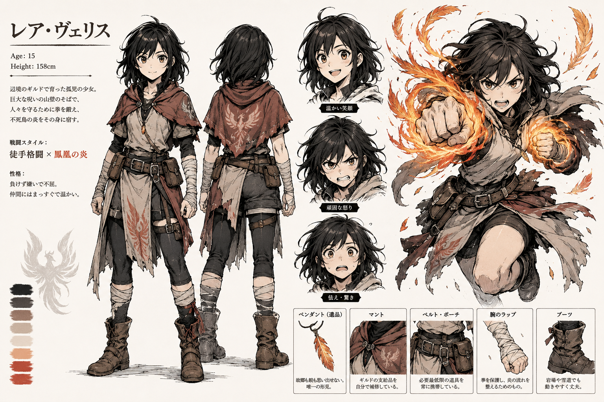

# Mira

## Identidade

- **Idade inicial:** 15 anos.
- **Origem:** órfã criada em uma guilda próxima à Muralha de Cinza.
- **Sobrenome:** desconhecido. Mira foi entregue ainda bebê à guilda.
- **Nome social:** quando precisa fornecer um nome completo, usa “Mira Vigília Corvo” como afiliação, não como sobrenome familiar. Alguns habitantes a chamam simplesmente de “Corvo”.
- **Combate:** corpo a corpo combinado com chamas.
- **Segredo inicial:** carrega Aelyra selada dentro de si.
- **Conhecimento inicial:** não sabe que é portadora nem conhece a verdade sobre sua mãe ou o selo criado por seu pai.
- **Objetivo inicial:** descobrir por que o mundo está acabando após ouvir essa afirmação de um Umbral durante o ataque à guilda.
- **Vocação:** deseja tornar-se médica e foi inspirada por Maela.
- **Gancho de viagem:** procurar conhecimento sobre Umbrais, assunto proibido em toda a península.

## Nascimento e marca — estabelecidos

Quinze anos antes do início, Míscar encontrou Aelyra durante a gestação de Mira. Ele matou o pai da criança e tentou atacar a mãe. Aelyra interveio, impressionada pela força com que a mulher protegeu a filha. A mãe conseguiu dar à luz, mas morreu no parto; Mira foi então entregue à Vigília do Corvo.

O ataque de Míscar marcou Mira e fez dela um receptáculo imperfeito da Fênix. Sua consequência é mágica: a assinatura divina de Aelyra pode ser rastreada quando as falhas da Muralha enfraquecem a camuflagem do selo.

### Posição e desenho do selo — estabelecidos

O selo hereditário de Aelyra aparece no abdômen de Mira, centrado no umbigo. Essa posição liga visualmente a Fênix à gestação, ao parto e à transmissão de mãe para filha. Em repouso, parece uma marca de nascença discreta formada por um ovo ou chama cercado por penas incompletas.

Linhas finas sobem do desenho até a base do esterno, indicando que o selo se conecta ao coração, onde a Ânima é ancorada e renovada. Quando Aelyra fornece poder, essas linhas acendem em âmbar e dourado antes de a chama alcançar os braços de Mira.

A ferida deixada por Míscar é visualmente separada do selo: uma ruptura negra atravessa o lado esquerdo do desenho e impede que o círculo se feche. Essa falha explica por que a assinatura de Aelyra vaza e pode ser rastreada.

**Referência visual canônica:** [Selos de Mira e Narel — versão 1](../../../imagens/concept-art/sistema-de-anima/selos-mira-narel/selos-mira-narel-v1.md).

## Personalidade

Mira é muito alegre e adora conhecer o mundo. É intensamente curiosa, fala demais e faz perguntas sem parar, chegando a irritar seus companheiros. Por ter crescido isolada junto às montanhas, cada cidade, costume, prato e criatura é uma descoberta.

Quando fica nervosa, tende a falar ainda mais. Sua curiosidade frequentemente coloca o grupo em perigo, mas também a faz perceber detalhes e questionar versões oficiais que outras pessoas aceitam.

Mira aceita piadas sobre não conhecer seu sobrenome e costuma responder com humor, embora o assunto possa tocar numa insegurança que ela raramente admite.

Sua formação médica permite que reconheça mãos frias, pulsos lentos e exaustão anormal nos mineiros de Lúmara antes de conhecer a explicação política ou mágica desses sintomas.

## Aparência canônica

- Cabelo preto, rebelde e aproximadamente na altura dos ombros.
- Corpo compacto e atlético.
- Túnica clara em camadas, calças escuras e botas reforçadas.
- Manto curto em tom terroso com símbolo de ave nas costas.
- Antebraços protegidos por faixas.
- Cinto com bolsas e equipamentos simples de viagem.
- Pingente em forma de pena herdado de sua mãe.
- Mãos femininas, com palmas menores e dedos afilados, preservando a força das posturas de luta.
- Chamas formam curvas e fragmentos semelhantes a penas.

Nomes e textos presentes dentro das folhas geradas não são canônicos.

## Progressão de combate — proposta

1. Golpes aquecidos e impulsos curtos de chama.
2. Penas de fogo usadas para defesa e movimento.
3. Manifestação parcial de asas.
4. Confronto interno pelo controle do corpo.
5. Cooperação consciente com Aelyra.
6. Sacrifício de Aelyra após o uso das Chamas da Vida.
7. Despertar das Chamas Puras, o primeiro poder verdadeiramente próprio de Mira.

## Pista do selo — estabelecida

Mira não sofre a exaustão normal de Ânima ao usar fogo. Enquanto outros usuários tremem e esfriam, ela termina as lutas inteira. Isso inicialmente parece talento; mais tarde revela que o selo preparado por seu pai antes de morrer utilizava Aelyra como combustível. A magia do selo persiste sem depender de um pai vivo.

As chamas emocionais são desbloqueadas por decisões e transformações, não por treinamento mecânico: ira convertida em proteção, tristeza aceita e esperança escolhida coletivamente.

## Imagens

- `../../../imagens/concept-art/personagens/guilda-vigilia-do-corvo/mira/mira-v1.png`: aparência inicial canônica.
- `../../../imagens/concept-art/personagens/guilda-vigilia-do-corvo/mira/chamas/`: estudos dos diferentes estados de chama.
