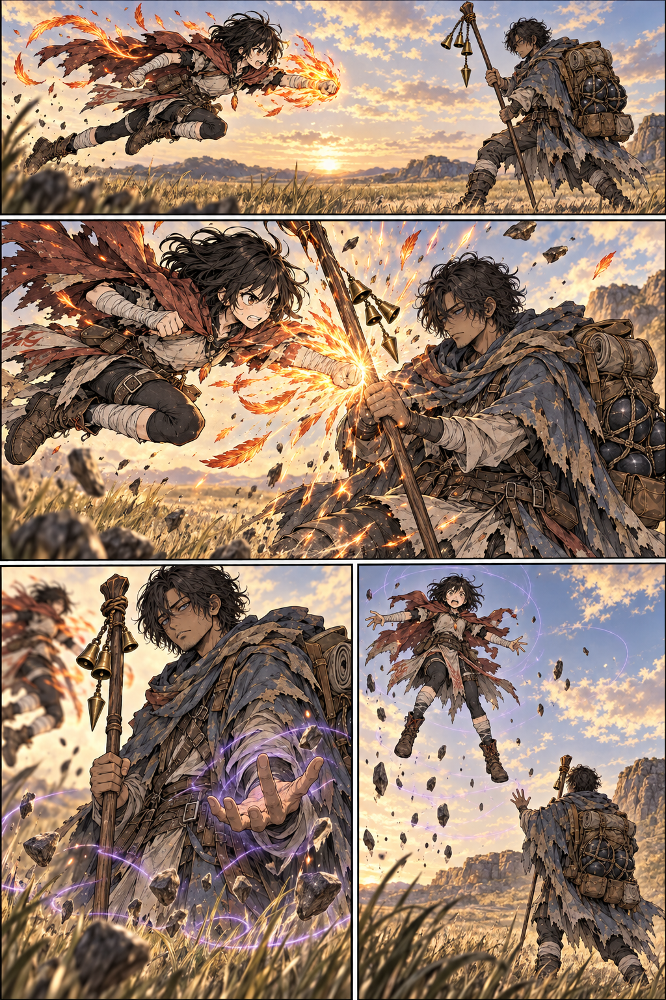

# Mira e Narel na planície — página 1 v1

> **Status:** referência de trabalho aguardando aprovação visual.

## Conteúdo

Mira avança com um soco voador de fogo; Narel bloqueia com o cajado, faz o gesto gravitacional e reduz o peso dela até fazê-la subir involuntariamente.

## Inspeção

- Quatro quadros em leitura ocidental, com Mira à esquerda e Narel à direita.
- O contato entre punho e cajado, as duas mãos de Narel, os sinos e a subida de Mira estão legíveis.
- Roupas, mochila, lastros, paletas e idades aparentes seguem as referências.
- A inclinação do cajado varia entre os quadros, mas não quebra a continuidade da ação.
- Não há texto; falas e efeitos sonoros permanecem para o letreiramento.

## Referências

- [Roteiro da sequência](../../../docs/cenas/mira-e-narel-embate-na-planicie.md)
- [Mira](../../concept-art/personagens/guilda-vigilia-do-corvo/mira/mira-v1.md)
- [Narel](../../concept-art/personagens/grandes-generais/trevas/receptaculo-de-dargan/receptaculo-de-dargan-v1.md)

