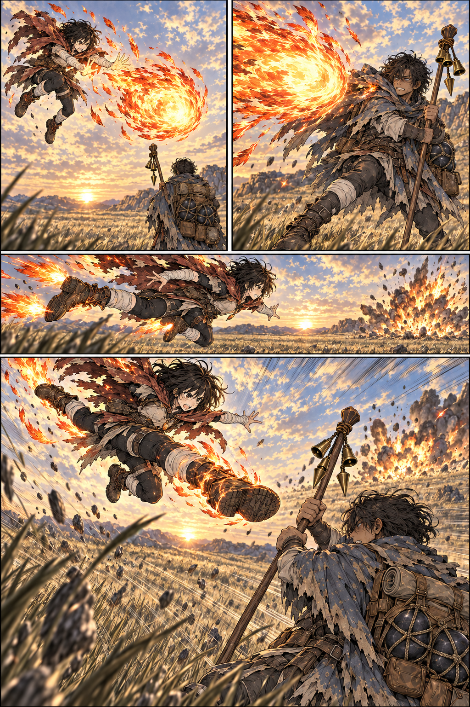

# Mira e Narel na planície — página 2 v1

> **Status:** referência de trabalho aguardando aprovação visual.

## Conteúdo

Suspensa, Mira lança uma bola de fogo. Narel se esquiva por pouco; ela usa chamas nos pés para mergulhar e prepara um chute descendente.

## Inspeção

- Quatro quadros preservam o cenário, a luz e o eixo de combate da página anterior.
- A bola de fogo, a explosão no terreno e a preparação do mergulho seguem a ordem planejada.
- O último quadro termina antes do contato entre a bota e o cajado.
- A passagem da bola fica extremamente próxima do manto e pode ser lida como um leve rasante; isso deve ser avaliado pelo autor.
- Não há texto; falas e efeitos sonoros permanecem para o letreiramento.

## Referências

- [Roteiro da sequência](../../../docs/cenas/mira-e-narel-embate-na-planicie.md)
- [Página 1](mira-narel-planicie-pagina-01-v1.md)
- [Mira](../../concept-art/personagens/guilda-vigilia-do-corvo/mira/mira-v1.md)
- [Narel](../../concept-art/personagens/grandes-generais/trevas/receptaculo-de-dargan/receptaculo-de-dargan-v1.md)

