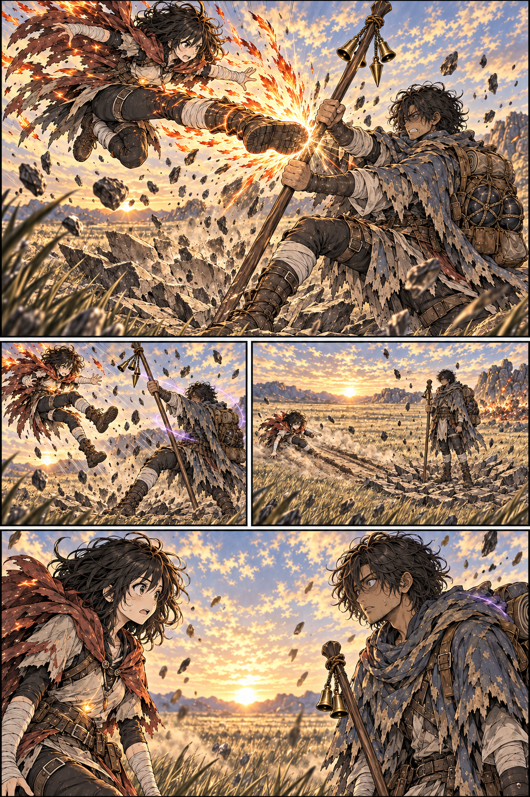

# Mira e Narel na planície — página 3 v1

> **Status:** referência de trabalho aguardando aprovação visual.

## Conteúdo

Narel bloqueia o chute descendente; o solo quebra sob seus pés. Ele afasta Mira, os dois recuperam o fôlego e terminam surpresos ao perceber uma presença familiar um no outro.

## Inspeção

- O grande impacto abre a página e mostra a sola, o cajado, as mãos e a ruptura física do chão.
- O afastamento e a aterrissagem aparecem em momentos separados.
- Rachaduras, área queimada e poeira preservam as consequências das páginas anteriores.
- O quadro final reúne os dois no mesmo espaço, suados, ofegantes e com surpresa legível; os brilhos âmbar e violeta permanecem discretos e não formam um vínculo visível.
- Não há texto; pensamentos e efeitos sonoros permanecem para o letreiramento.

## Referências

- [Roteiro da sequência](../../../docs/cenas/mira-e-narel-embate-na-planicie.md)
- [Página 2](mira-narel-planicie-pagina-02-v1.md)
- [Selos de Mira e Narel](../../concept-art/sistema-de-anima/selos-mira-narel/selos-mira-narel-v1.md)

