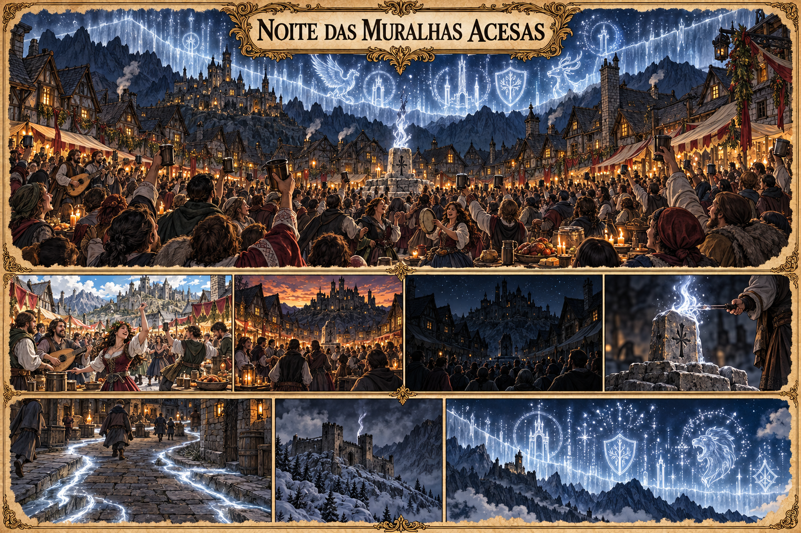

# Noite das Muralhas Acesas — concept art v1

> **Status:** referência visual canônica. A celebração, o ritual e a aparência desta versão foram aprovados pelo autor.

## Celebração estabelecida

A **Noite das Muralhas Acesas** é uma celebração nacional milenar de Valedorn. Durante o dia e a noite, cidades e povoados realizam festas com comida, música, dança e muita bebida para comemorar mais um ano em que a Muralha de Cinza não caiu.

## Acendimento da Segunda Muralha

Pouco antes da meia-noite, todas as luzes comuns são apagadas. Quando soam as doze badaladas:

1. Uma chama prateada é acesa sobre um antigo marco de pedra em cada localidade.
2. A chama percorre marcos, ruas e estradas como veios luminosos.
3. As fortalezas da Muralha deveriam acender primeiro, seguidas pelas guildas, povoados e cidades do interior.
4. Quando as linhas se conectam, uma imensa muralha translúcida aparece no céu por alguns minutos.
5. Runas se elevam e explodem silenciosamente em figuras como torres, escudos e criaturas históricas.
6. A população ergue os copos e proclama: **“Mais um ano de pé!”**

Depois do Acendimento, a festa e a bebida recomeçam.

## Origem esquecida

O ritual não nasceu como celebração. Era um antigo procedimento de manutenção destinado a testar ou estabilizar os nós da Muralha de Cinza por meio de uma pulsação sincronizada.

Essa função foi esquecida pela maior parte da população. No interior, a cerimônia tornou-se um espetáculo cada vez mais grandioso, enquanto fortalezas e guildas montanhesas essenciais receberam cada vez menos recursos. Algumas já não conseguem acender sua chama adequadamente.

## Gancho narrativo

Em algum ano, a Segunda Muralha pode aparecer com grandes trechos apagados. A população pode interpretar isso como falha do espetáculo, enquanto as guildas da montanha reconhecem um sinal grave. A ocorrência concreta desse evento ainda não foi fixada na cronologia.

## Aparência canônica

- praça montanhosa lotada, decorada em vinho, dourado e folhagens;
- Segunda Muralha prateada cobrindo o céu como uma aurora arquitetônica;
- formas mágicas de torres, escudos e criaturas;
- veios de luz correndo entre as pedras das ruas;
- marco central simples, talhado em pedra;
- fortaleza distante apagada, contrastando com a festa do interior.

Símbolos, brasões, personagens, edifícios e formas específicas criadas pela imagem não acrescentam novos fatos ao cânone.

## Direção visual usada

Prancha cultural em pergaminho, tinta e aquarela, combinando panorama festivo e sequência do Acendimento. A imagem foi gerada com o gerador integrado, usando a Praça de Rochafria e a Geada Cinzenta como referências visuais.
