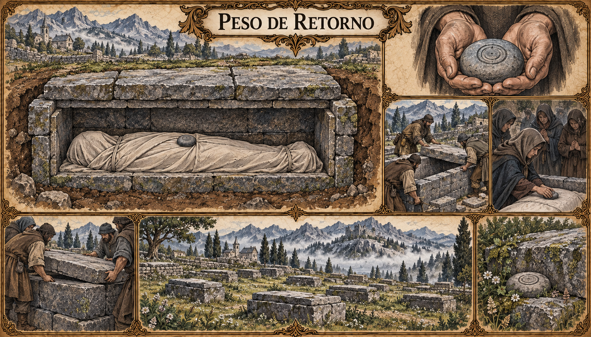

# Peso de Retorno — concept art v1

> **Status:** referência visual canônica. O costume e a aparência desta versão foram aprovados pelo autor.

## Costume estabelecido

Em Valedorn, os mortos são sepultados em túmulos de pedra. Antes que a sepultura seja fechada, uma pequena pedra chamada **Peso de Retorno** é colocada sobre o peito do falecido.

A crença diz que o Peso de Retorno impede que a Ânima da pessoa se perca. Isso está estabelecido como crença funerária de Valedorn, não como efeito mágico comprovado.

## Aparência canônica

- corpo completamente envolvido por uma mortalha simples;
- sepultura retangular revestida e fechada por blocos e lajes de pedra;
- Peso de Retorno pequeno, liso e arredondado, com um sulco circular raso;
- colocação da pedra por uma pessoa próxima antes do fechamento;
- cemitérios formados por túmulos baixos de pedra entre vegetação e montanhas.

O Peso de Retorno é pequeno, liso e arredondado, marcado por um sulco circular raso. O morto é envolvido por mortalha simples, e o túmulo baixo é inteiramente revestido e fechado por blocos e lajes. Cemitérios valedornianos seguem a aparência pedregosa e integrada à vegetação mostrada na prancha.

## Pontos em aberto

- quem escolhe e coloca o Peso de Retorno;
- origem da pedra e possibilidade de reutilização;
- diferenças regionais, religiosas ou sociais;
- inscrições, símbolos ou ausência deliberada deles;
- palavras pronunciadas durante o sepultamento;
- destino dado ao túmulo quando a família desaparece;
- existência ou não de qualquer efeito real sobre a Ânima.

## Direção visual usada

Prancha cultural em pergaminho, tinta e aquarela, com corte da sepultura, construção do túmulo, colocação da pedra e panorama de um cemitério. A imagem foi gerada com o gerador integrado, usando Pedra-Mansa e a Geada Cinzenta como referências de linguagem visual.
