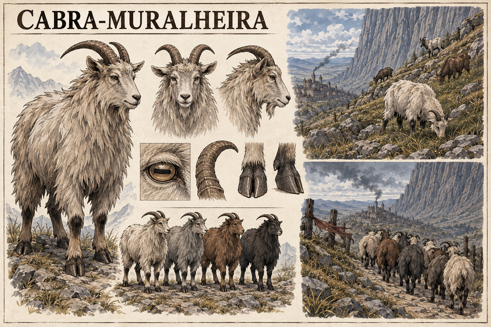

# Cabra-muralheira — concept art v1

> **Status:** referência visual canônica aprovada pelo autor. A aparência, a pelagem e a anatomia apresentadas nesta prancha estão estabelecidas.

## Conceito estabelecido

A **Cabra-muralheira** é um animal comum das encostas próximas à Muralha de Cinza. Ela não possui poderes visíveis. Sua sensibilidade à Ânima manifesta-se por comportamento: percebe mudanças na pulsação da Muralha e abandona as encostas dias antes de uma falha.

Essa reação transforma os rebanhos num instrumento involuntário de diagnóstico. Pastores acostumados à região podem notar que há algo errado antes que estudiosos, soldados ou mecanismos oficiais reconheçam o perigo.

## Relação com o piloto

A espécie estabelece como parte da fauna de Valedorn as cabras mostradas no piloto. Na página 11, o rebanho comprimido no lado leste da cerca e voltado para oeste não reage apenas à fumaça: as cabras já sentem a alteração da Muralha e procuram afastar-se dela.

## Aparência canônica

- Cabra montanhesa de porte médio, compacta e resistente.
- Pelagem longa e áspera, adequada ao frio e ao vento das encostas.
- Variações naturais em creme, cinza, castanho e carvão.
- Chifres curvados para trás, cascos gastos e pupilas horizontais.
- Nenhuma mutação ou característica ostensivamente mágica.

## Comportamento estabelecido

Quando a pulsação da Muralha muda, a Cabra-muralheira percebe a alteração e abandona as encostas com dias de antecedência. Esse é o limite do comportamento estabelecido.

## Leitura visual canônica

Em condições normais, o animal pasta em terrenos íngremes. A prancha representa a reação à Muralha como uma sequência possível:

1. interromper a alimentação;
2. voltar a atenção para a montanha;
3. agrupar-se de maneira incomum;
4. descer ou migrar para longe da Muralha;
5. recusar-se a retornar às encostas enquanto a alteração persistir.

A antecedência de dias é estabelecida, tornando o comportamento útil como presságio e não como detector imediato de combate. A sequência visual da prancha é canônica, embora intensidade e alcance da percepção permaneçam abertos.

## Limites da canonização

- A Cabra-muralheira não lança magia, não apresenta brilho e não possui chifres encantados.
- A intensidade e o alcance exatos de sua sensibilidade ainda podem ser definidos.
- O comportamento não revela qual tipo de falha ocorrerá nem explica sua causa.
- Quantidade de animais, cores individuais e cenário das vinhetas podem variar.

## Direção usada na geração

Prancha horizontal de fauna em tinta e aquarela sobre papel claro, inspirada diretamente nas cabras da página 11 do piloto. Mostra vistas anatômicas, variações naturais de pelagem, pastoreio normal e um rebanho abandonando a encosta diante da Muralha de Cinza. O animal permanece zoologicamente crível e sem sinais visíveis de poder.
