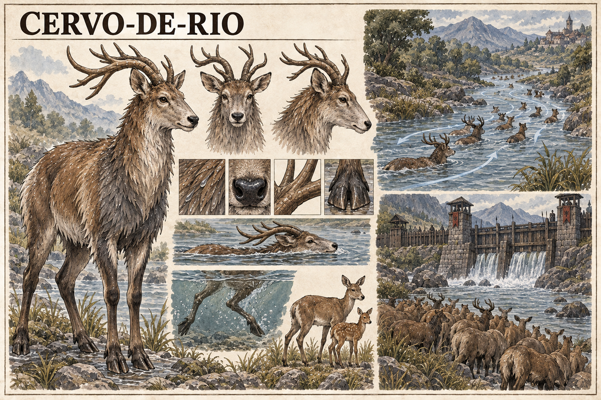

# Cervo-de-rio — concept art v1

> **Status:** referência visual canônica aprovada pelo autor. Anatomia semiaquática, pelagem e galhadas mostradas na prancha estão estabelecidas.

## Conceito estabelecido

O **Cervo-de-rio** é um cervídeo semiaquático de Valedorn. Seus rebanhos migram acompanhando correntes naturais de Ânima presentes na água.

Barragens militares e fronteiras interromperam essas rotas. A alteração não precisa ser percebida como magia pelas autoridades: para os animais, bloquear o rio significa cortar o caminho que orientava sua migração.

## Função de diagnóstico

Mudanças coletivas de rota, rebanhos acumulados numa margem ou a ausência de cervos em travessias antigas podem revelar que uma corrente natural foi interrompida. O Cervo-de-rio não identifica a causa política ou mágica do bloqueio; apenas tenta continuar seguindo a água.

## Aparência canônica

- Cervídeo de porte médio a grande, esguio e de aparência natural.
- Pelagem densa que escoa água, em tons de castanho fluvial, ardósia molhada e creme.
- Ombros fortes para natação e pernas alongadas para áreas rasas.
- Cascos largos e abertos, adequados a lama, pedras molhadas e margens alagadas.
- Galhadas compactas e voltadas para trás, sem brilho ou propriedades mágicas visíveis.
- Fêmeas e filhotes seguem a mesma rota migratória dos rebanhos.

## Ecologia visual canônica

- Natação com cabeça, pescoço e parte do dorso acima da água.
- Impulso submerso das quatro pernas durante travessias profundas.
- Deslocamento coletivo por rios, remansos e corredores de vegetação ribeirinha.
- Acúmulo do rebanho diante de barragens, paliçadas e postos militares que cortam o curso da água.

## Limites da canonização

- A espécie não possui guelras, nadadeiras, cauda de peixe nem magia visível.
- As linhas claras sobre a água na prancha são indicação editorial das correntes de Ânima, não algo normalmente visível no mundo.
- O alcance da percepção, a duração das migrações e suas épocas exatas ainda podem ser definidos.
- A barragem e os estandartes da vinheta não estabelecem uma fortificação, facção ou localização específica.
- Quantidade de animais, desenhos individuais das galhadas e cenário das vinhetas podem variar.

## Direção usada na geração

Prancha horizontal de fauna em tinta e aquarela sobre papel claro, seguindo a linguagem da Cabra-muralheira. Apresenta vistas anatômicas, adaptações à água, natação, fêmea e filhote, migração por uma corrente natural e um rebanho bloqueado por uma barragem militar medieval.
