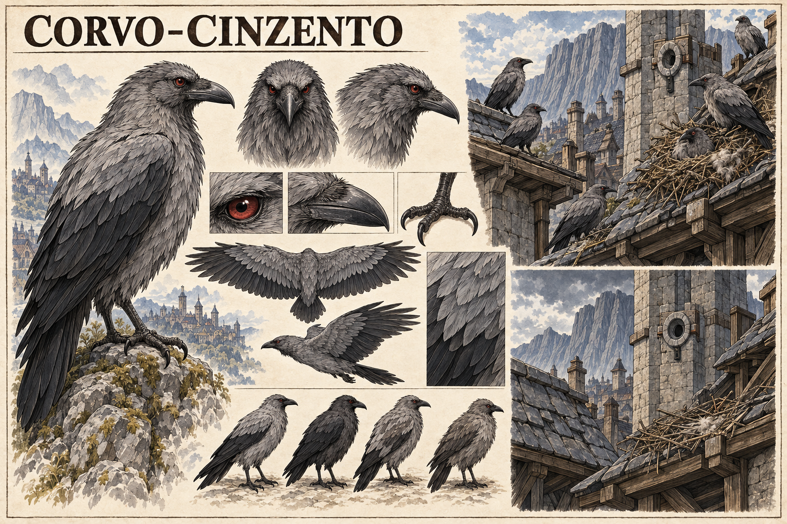

# Corvo-cinzento de olhos vermelhos — concept art v1

> **Status:** referência visual canônica aprovada pelo autor. Anatomia, tonalidades e construção dos ninhos mostradas na prancha estão estabelecidas.

## Conceito estabelecido

O **Corvo-cinzento de olhos vermelhos** é uma ave de Valedorn que constrói ninhos perto de nós mágicos estáveis. O desaparecimento dos corvos de uma área pode indicar que um selo verdadeiro foi removido.

A espécie reforça simbolicamente a Vigília do Corvo, especialmente porque o Solar da Vigília ocupa um nó secundário verdadeiro. Essa relação é simbólica e ecológica; não estabelece que as aves sejam familiares da guilda nem que tenham dado origem ao seu nome.

## Função de diagnóstico

A presença contínua de ninhos sugere estabilidade do nó próximo. Quando o selo verdadeiro é removido, as aves abandonam o local, deixando telhados, torres e árvores incomumente silenciosos. O sinal é indireto: os corvos não explicam o ocorrido nem distinguem suas causas.

## Relação possível com o piloto

A ausência geral de pássaros percebida por Mira na página 11 é compatível com esse comportamento, mas a cena não estabelece que todas as aves ausentes sejam corvos-cinzentos. A espécie amplia a leitura do presságio sem substituir o que já aparece na página.

## Aparência canônica

- Corvídeo de porte médio a grande e anatomia natural.
- Plumagem cinza-ardósia em camadas, com asas, cauda e bico mais escuros.
- Íris vermelho-rubi foscas, sem luminosidade sobrenatural.
- Bico robusto, garras escuras e postura atenta.
- Pequenas variações naturais entre cinza-claro, ardósia e carvão.

## Ecologia visual canônica

- Ninhos comuns de gravetos, lã e capim seco.
- Preferência por beirais, torres, árvores e ruínas próximas a nós antigos.
- Agrupamentos tranquilos enquanto o nó permanece estável.
- Ninhos intactos e vazios como sinal visual após a remoção do selo.

## Limites da canonização

- A ave não possui aura, olhos luminosos, fala ou capacidade de lançar magia.
- O alcance e a antecedência exatos de sua percepção ainda podem ser definidos.
- O desaparecimento é um indício, não uma prova exclusiva de remoção de selo.
- A espécie não é automaticamente domesticada pela Vigília do Corvo.
- Quantidade de aves, posição dos ninhos e arquitetura das vinhetas podem variar.

## Direção usada na geração

Prancha horizontal de fauna em tinta e aquarela sobre papel claro, seguindo a linguagem da Cabra-muralheira. Apresenta vistas anatômicas, olho, bico, garras, plumagens e voo, além de duas vinhetas equivalentes: ninhos ocupados junto a um nó estável e ninhos vazios após sua remoção. O Solar da Vigília serviu como referência arquitetônica e simbólica.
