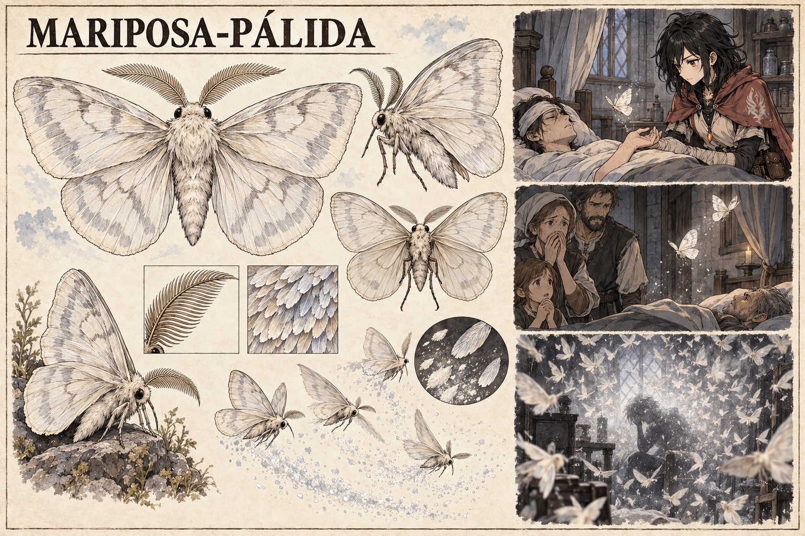

# Mariposa-pálida — concept art v1

> **Status:** referência visual canônica aprovada pelo autor. A anatomia e a manifestação visual do pó estão estabelecidas; o mecanismo e o limiar exatos do perigo permanecem em aberto.

## Conceito estabelecido

A **Mariposa-pálida** aproxima-se de pessoas em esgotamento grave de Ânima, atraída pelo processo de recuperação da pessoa. Ao voar, libera um pó fino de Ânima.

Uma grande concentração dessas mariposas é extremamente perigosa. Para o povo, sua chegada é presságio de morte; para Mira, pode tornar-se um sinal clínico de que alguém sofre esgotamento grave e começou a recuperar Ânima.

## Escala de leitura

- **Um indivíduo:** pode oferecer a Mira um sinal discreto durante a avaliação de um paciente.
- **Alguns indivíduos:** provocam medo popular e fazem famílias interpretarem a aproximação como anúncio de morte.
- **Grande concentração:** constitui perigo real, enchendo o ambiente de mariposas e pó de Ânima.

Essa progressão estabelece a diferença entre diagnóstico e ameaça sem definir uma contagem exata.

## Aparência canônica

- Mariposa de tamanho médio e anatomia natural.
- Asas branco-giz e marfim, com veios suaves em cinza frio.
- Corpo coberto por penugem clara e antenas plumosas.
- Olhos pequenos, negros e sem brilho sobrenatural.
- Bordas das asas levemente translúcidas.

## Pó de Ânima

A prancha representa o pó como escamas finas liberadas durante o voo. Ele deve parecer matéria delicada suspensa no ar, não fumaça, fogo ou brilho de fada.

O fato de o pó conter Ânima e de enxames serem perigosos está estabelecido. Ainda não está definido se o perigo vem de intoxicação, interferência na recuperação, drenagem, reação em cadeia ou outro mecanismo.

## Leitura cultural e clínica

O povo associa a mariposa à morte porque ela aparece ao redor de pessoas já muito debilitadas e porque grandes concentrações são perigosas. Mira pode separar correlação de diagnóstico: a presença de uma mariposa não significa que a morte seja inevitável, mas revela uma condição que merece atenção imediata.

## Limites da canonização

- As mariposas não possuem tamanho monstruoso, fala ou forma humanoide.
- O número exato a partir do qual a concentração se torna perigosa permanece em aberto.
- A vinheta com Mira ilustra um possível uso clínico e não estabelece um paciente ou acontecimento específico.
- A aparência da enfermaria e das pessoas sem nome pode variar.

## Direção usada na geração

Prancha horizontal de fauna em tinta e aquarela sobre papel claro. Apresenta anatomia, asas, antenas, escamas e voo, seguida por três vinhetas: Mira observando uma única mariposa junto a um paciente, uma família interpretando algumas mariposas como presságio e uma grande concentração perigosa obscurecendo um aposento com pó de Ânima.
