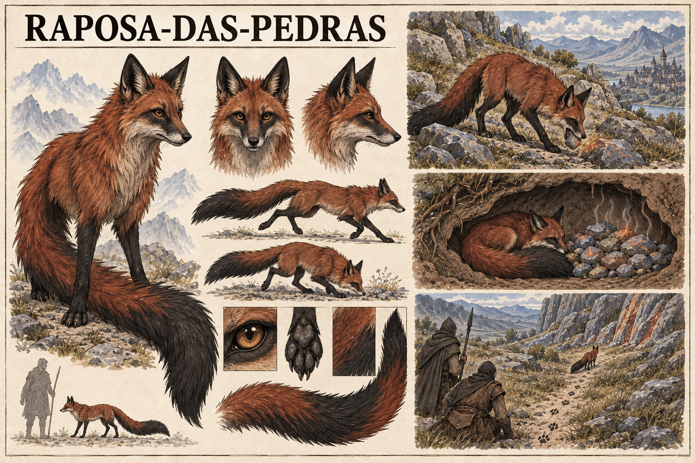

# Raposa-das-pedras — concept art v1

> **Status:** referência visual canônica aprovada pelo autor. As proporções, a anatomia, a pelagem vermelha e preta e a cauda alongada mostradas estão estabelecidas.

## Conceito estabelecido

A **Raposa-das-pedras** é uma pequena predadora de Valedorn, vermelha e preta, com uma cauda mais alongada que a de uma raposa real. Ela procura fragmentos minerais aquecidos e os acumula dentro de sua toca.

Caçadores podem encontrar veios de Ânima observando quais pedras a raposa escolhe, onde as recolhe e que caminho percorre de volta. A espécie funciona como instrumento de prospecção natural sem manifestar poderes visíveis.

## Função de diagnóstico

Uma toca com muitos fragmentos aquecidos indica que a raposa encontrou afloramentos ou depósitos próximos. Pegadas repetidas entre a toca e uma mesma formação rochosa podem conduzir observadores até um veio de Ânima.

O comportamento oferece um indício, não uma medição precisa da quantidade, pureza ou profundidade do veio.

## Aparência canônica

- Corpo pequeno, esguio e ágil, próximo ao de uma raposa natural.
- Pelagem vermelho-ferrugem profunda, com pernas, orelhas e marcas faciais pretas.
- Uma única cauda peluda, sinuosa e muito alongada, com grande faixa negra na extremidade.
- Olhos âmbar, patas escuras e focinho estreito.
- Nenhuma mutação ou sinal ostensivamente mágico.

## Ecologia visual canônica

- Busca de fragmentos entre pedras expostas e fissuras minerais.
- Transporte de uma pedra por vez na boca.
- Toca natural contendo uma reserva deliberada de fragmentos arredondados.
- Repouso próximo à reserva aquecida.
- Pegadas e rotas recorrentes utilizadas por caçadores para localizar o afloramento.

## Limites da canonização

- A Raposa-das-pedras possui apenas uma cauda e não é uma criatura espiritual.
- Os fragmentos são minerais comuns aquecidos pela proximidade da Ânima, não cristais luminosos ou tesouro.
- A razão exata pela qual a espécie acumula as pedras ainda pode ser definida.
- O alcance da percepção, a temperatura preferida e a distância percorrida permanecem em aberto.
- Os caçadores e o afloramento mostrados na prancha não estabelecem personagens ou localização específica.

## Direção usada na geração

Prancha horizontal de fauna em tinta e aquarela sobre papel claro, seguindo a linguagem das demais espécies de Valedorn. Apresenta anatomia, movimento, estudo da cauda, pelagem e patas, além da busca por fragmentos, uma toca com reserva mineral e caçadores observando a rota até um veio.
