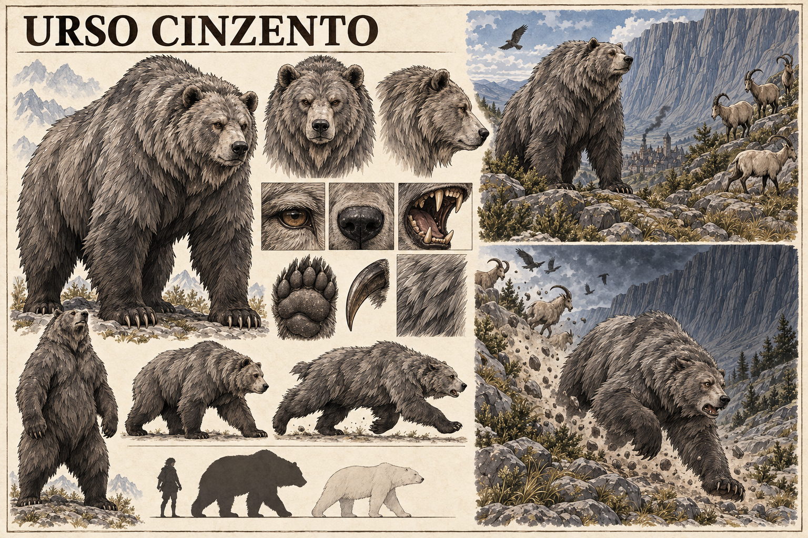

# Urso cinzento — concept art v1

> **Status:** referência visual canônica aprovada pelo autor. Anatomia, pelagem e proporções apresentadas nesta prancha estão estabelecidas.

## Conceito estabelecido

O **Urso cinzento** é um grande animal da região montanhosa de Valedorn. É maior que um urso-polar e constitui o maior predador local, mas não possui natureza ou poderes mágicos.

Sua fuga das montanhas transforma-se num sinal particularmente assustador: alguma coisa foi capaz de expulsar o animal que normalmente não precisa fugir de nenhum outro predador da região.

## Função de diagnóstico

O urso não percebe necessariamente a Ânima como as demais espécies diagnósticas. O sinal está na quebra extrema de seu comportamento territorial. Um Urso cinzento abandonando as montanhas indica uma ameaça capaz de superar o maior predador local, mesmo quando essa ameaça ainda não foi vista.

## Aparência canônica

- Corpo colossal e natural, maior que o de um urso-polar.
- Ombros muito altos, pescoço grosso e musculatura pesada.
- Pelagem longa em cinza-ardósia e carvão, com pelos externos prateados.
- Cabeça larga, orelhas pequenas e arredondadas.
- Patas enormes, garras escuras e gastas pelo terreno rochoso.
- Olhos castanhos sem brilho ou sinal sobrenatural.

## Comportamento visual canônico

- Postura calma e dominante em território montanhoso normal.
- Outros animais mantendo distância sem necessidade de confronto.
- Corrida pesada descendo a encosta quando expulso da região.
- Orelhas recolhidas, corpo baixo e atenção voltada apenas para a fuga.
- Pedras e vegetação deslocadas pelo peso, reforçando a urgência.

## Limites da canonização

- O Urso cinzento não possui runas, aura, mutações ou resistência sobrenatural.
- A comparação com o urso-polar estabelece porte superior, não uma medida exata.
- A causa da fuga não aparece na prancha e não é definida por ela.
- A presença simultânea de cabras e aves na vinheta é composição narrativa, não um evento específico estabelecido.
- Cicatrizes, variações individuais, território e hábitos reprodutivos permanecem em aberto.

## Direção usada na geração

Prancha horizontal de fauna em tinta e aquarela sobre papel claro, seguindo a linguagem da Cabra-muralheira. Apresenta anatomia, cabeça, patas, garras, pelagem, locomoção e comparação de escala com humano e urso-polar, além de duas vinhetas: o predador dominante em seu território e o mesmo animal fugindo da Muralha diante de uma ameaça invisível.
