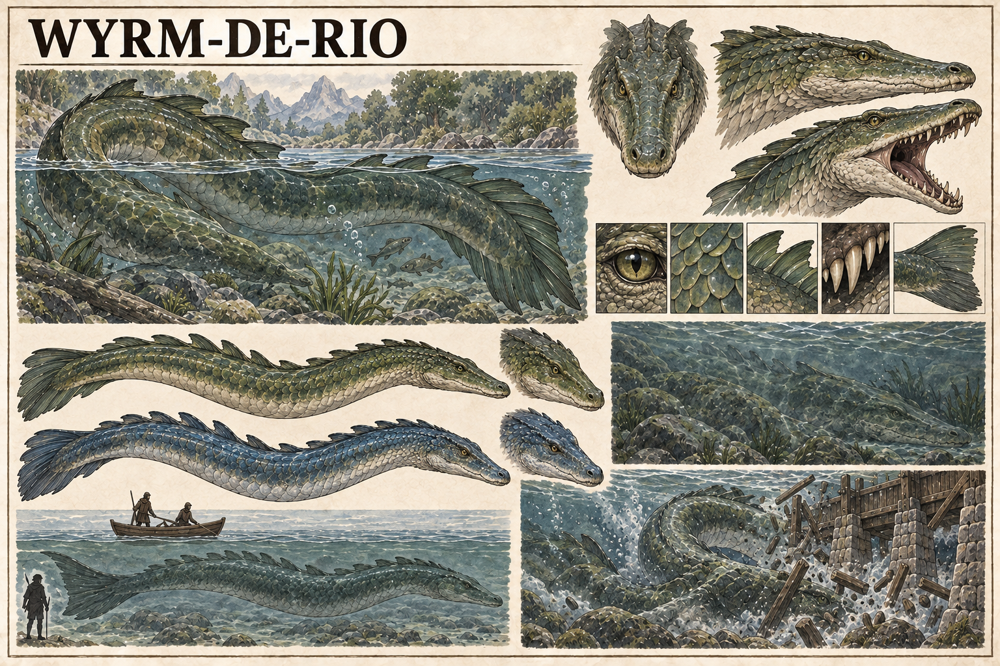

# Wyrm-de-rio — concept art v1

> **Status:** referência visual canônica. A espécie, sua anatomia e a aparência desta versão foram aprovadas pelo autor.

## Conceito estabelecido

O Wyrm-de-rio é uma criatura aquática muito rara que vive nos rios de Valedorn. Seus indivíduos podem apresentar coloração verde ou azul em tons que se confundem com a água, dificultando sua percepção mesmo quando estão próximos da superfície.

São criaturas realmente perigosas e ocasionalmente destroem barragens.

## Aparência canônica

- corpo longo, serpentiforme e musculoso;
- ausência de asas e membros locomotores evidentes;
- cabeça baixa com traços crocodilianos e mandíbulas poderosas;
- escamas sobrepostas, cristas semelhantes a nadadeiras e cauda larga;
- camuflagem natural formada por manchas que lembram pedras, algas e reflexos da corrente;
- rompimento de barragens por impacto e pressão do corpo contra estruturas submersas.

## Pontos em aberto

- tamanho e longevidade;
- alimentação e território;
- natureza inteiramente biológica ou alguma relação com a Ânima;
- motivo pelo qual atacam ou atravessam barragens;
- frequência real dos encontros;
- reprodução e desenvolvimento dos filhotes;
- sinais usados por barqueiros para detectar sua presença;
- comportamento diante de pessoas e embarcações.

## Direção visual usada

Prancha de bestiário em pergaminho, tinta e aquarela, mostrando variantes verde e azul, anatomia, camuflagem submersa, escala e destruição de uma barragem. A imagem foi gerada com o gerador integrado, usando o Cervo-de-rio e o Urso cinzento como referências de linguagem visual.
