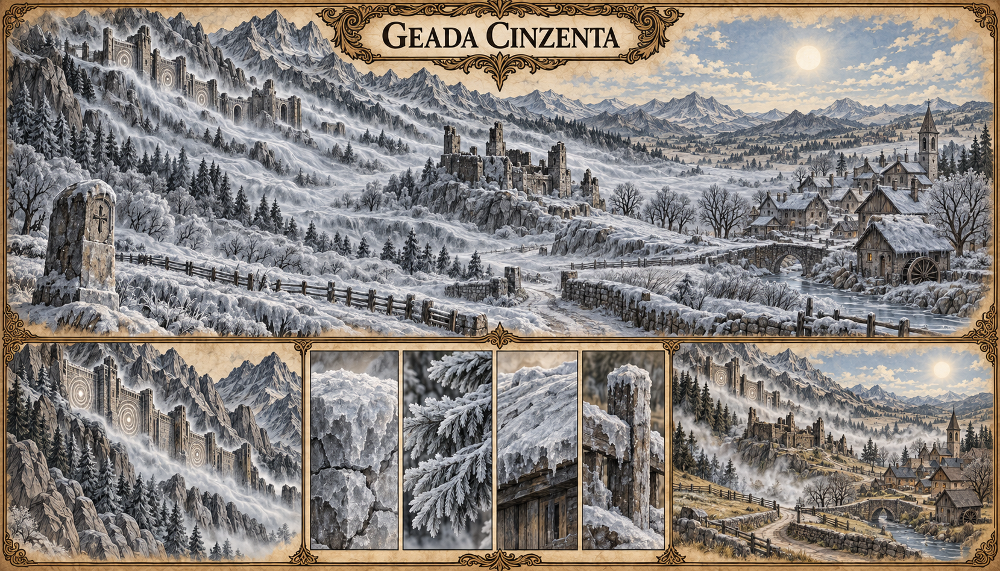

# Geada Cinzenta — concept art v1

> **Status:** referência visual canônica. O fenômeno e a aparência desta versão foram aprovados pelo autor.

## Conceito estabelecido

A Geada Cinzenta é uma frente fria proveniente da Muralha de Cinza. Ao atravessar uma região, deixa sobre o ambiente uma camada de gelo opaco que não derrete mesmo sob a luz do sol. O gelo desaparece apenas quando a pulsação da Muralha se estabiliza.

O fenômeno funciona como um sintoma territorial da instabilidade da Muralha, e não como uma nevasca comum.

## Aparência canônica

- frente baixa de névoa branca e cinzenta descendo das montanhas;
- gelo fosco e mineral, sem transparência e sem degelo visível ao sol;
- cobertura de pedras, árvores, telhados, estradas e plantações;
- desaparecimento do gelo em névoa clara quando a pulsação se regulariza;
- paisagem da Marca Cinzenta com povoado, estrada e fortaleza desativada.

Os círculos luminosos, edifícios específicos, símbolos e demais detalhes acidentais da imagem não estabelecem novos locais nem mecanismos da Muralha.

## Pontos em aberto

- alcance e duração de cada ocorrência;
- frequência e sazonalidade;
- velocidade de avanço da frente fria;
- efeitos diretos sobre pessoas, animais, plantações e construções;
- possibilidade de prever ou medir sua chegada;
- relação entre a intensidade da geada e a gravidade da instabilidade;
- regiões de Valedorn que já registraram o fenômeno.

## Direção visual usada

Prancha ambiental em pergaminho, tinta e aquarela, com panorama principal, detalhes do gelo e comparação entre a ocorrência e a estabilização. A imagem foi gerada com o gerador integrado, usando Pedra-Mansa e a Marca Cinzenta como referências visuais.
