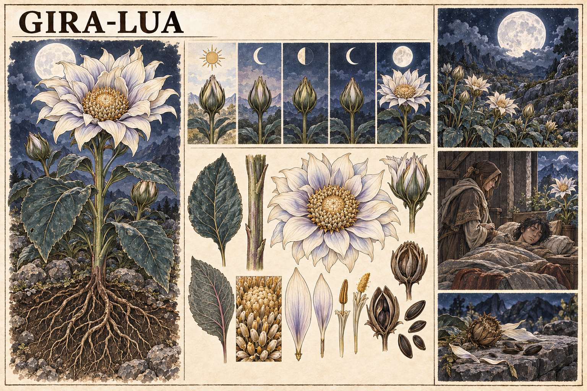

# Gira-Lua — concept art v1

> **Status:** referência visual canônica. A espécie, o nome Gira-Lua, o funcionamento e a aparência desta versão foram aprovados pelo autor.

## Conceito estabelecido

O Gira-Lua é uma planta de Valedorn semelhante a um girassol. Permanece fechado durante o dia e nas demais fases lunares, desabrochando somente à noite sob a lua cheia. Sua presença acelera a recuperação de Ânima.

## Aparência canônica

- porte alto, caule robusto e folhas largas verde-azuladas;
- pétalas claras, com sombras azul-lilás, e centro de tom pérola-dourado;
- flor orientada para a lua cheia;
- raízes extensas e sementes escuras;
- cultivo possível em áreas pedregosas e frias;
- uso acompanhado por alguém com conhecimento medicinal.

## Limite narrativo canônico

O Gira-Lua acelera a recuperação natural, sem criar Ânima do nada, ressuscitar alguém ou garantir a recuperação de um corpo que já não consiga reagir.

## Pontos em aberto

- qual parte da planta produz o efeito;
- se precisa ser colhida, preparada ou apenas permanecer próxima;
- duração, alcance e intensidade do efeito;
- conservação fora da noite de lua cheia;
- efeitos adversos, contraindicações e risco de uso excessivo;
- distribuição e valor econômico em Valedorn.

## Direção visual usada

Prancha botânica em pergaminho, tinta e aquarela, mostrando anatomia, ciclo lunar e uma vinheta clínica. A imagem foi gerada com o gerador de imagens integrado, usando as pranchas da Raiz-de-brasa e do Lírio-do-pulso como referências de linguagem visual.
