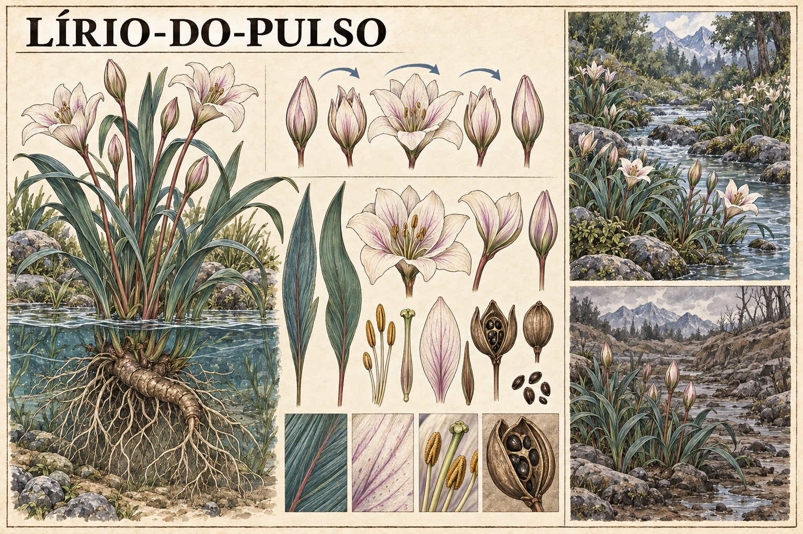

# Lírio-do-pulso — concept art v1

> **Status:** referência visual canônica aprovada pelo autor. Anatomia botânica e cores mostradas estão estabelecidas; ritmo exato e distribuição permanecem em aberto.

## Conceito estabelecido

O **Lírio-do-pulso** abre e fecha num ritmo semelhante a batimentos quando cresce perto de água rica em Ânima. Perto de regiões drenadas, permanece fechado.

Seu comportamento torna visível a condição da água sem produzir luz, som ou efeito mágico ostensivo. A flor funciona como indicador natural da circulação de Ânima.

## Função de diagnóstico

O movimento de abertura e fechamento indica que a água próxima mantém uma corrente rica em Ânima. Exemplares vivos que permanecem fechados podem sinalizar drenagem da região.

O diagnóstico depende do comportamento coletivo e persistente das plantas. Uma flor fechada isoladamente não estabelece por si só que a água foi drenada.

## Aparência canônica

- Planta perene de margens úmidas e águas rasas.
- Folhas longas e estreitas em verde-azulado, com nervuras discretamente avermelhadas.
- Caules flexíveis em tons de verde e vermelho suave.
- Flores em forma de taça, com pétalas marfim e veios rosados ou violetas.
- Rizoma espesso e raízes adaptadas a solo saturado.
- Frutos secos com sementes escuras.

## Ciclo visual canônico

A prancha representa um ciclo de cinco estados: botão fechado, abertura inicial, flor completamente aberta, fechamento e retorno ao botão. As setas são indicação editorial e não existem no mundo.

Ainda não está definido se plantas próximas pulsam em sincronia, se o ritmo varia com a intensidade da corrente ou quanto tempo dura cada ciclo.

## Região drenada

Perto de água drenada de Ânima, a planta continua viva e ereta, mas a flor não se abre. Essa condição deve ser distinguida de murcha, seca ou morte vegetal comum.

## Limites da canonização

- O Lírio-do-pulso não brilha, fala, pulsa como carne nem possui anatomia semelhante a um coração.
- As linhas claras na água são recurso editorial para indicar corrente de Ânima.
- Cor, tamanho, estação de floração e distribuição geográfica exata permanecem em aberto.
- O mapa não define se a planta possui propriedades medicinais, alimentares ou tóxicas.

## Direção usada na geração

Prancha botânica horizontal em tinta e aquarela sobre papel claro, seguindo a linguagem da Raiz-de-brasa. Apresenta a planta completa acima e abaixo da água, folhas, flores, sementes e rizoma, uma sequência de abertura e fechamento e duas margens comparativas: água rica em Ânima com flores ativas e região drenada com exemplares vivos permanentemente fechados.
