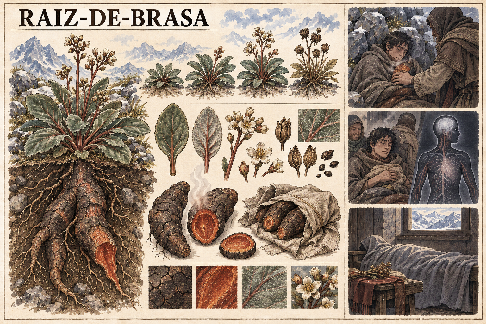

# Raiz-de-brasa — concept art v1

> **Status:** referência visual canônica aprovada pelo autor. Anatomia botânica, folhas, flores e raiz mostradas estão estabelecidas; preparo e aplicação permanecem em aberto.

## Conceito estabelecido

A **Raiz-de-brasa** retém calor e ajuda no tratamento inicial de frio e tremores. Ela não repõe Ânima: apenas mascara sintomas.

Quando usada de maneira irresponsável, a melhora aparente pode esconder a continuidade do esgotamento e levar à morte. A planta é útil como primeiros cuidados, mas não substitui o tratamento da causa.

## Função clínica

O calor armazenado pela raiz pode reduzir o frio e os tremores de uma pessoa debilitada. Como esses mesmos sinais podem acompanhar o esgotamento de Ânima, o desaparecimento deles não comprova recuperação.

A distinção é especialmente importante para Mira: o paciente pode parecer aquecido e estável enquanto sua reserva de Ânima continua perigosamente baixa.

## Aparência canônica

- Planta baixa e resistente, adaptada a terrenos frios e pedregosos.
- Folhas largas em verde-acinzentado, organizadas numa roseta próxima ao solo.
- Caules discretamente avermelhados e pequenas flores claras.
- Raiz de reserva grossa e ramificada.
- Casca castanho-carvão, irregular e semelhante a pedra rachada.
- Interior em ocre e vermelho profundo, visivelmente morno apenas por vapor e distorção do ar.

## Retenção de calor

A prancha representa a raiz recém-cortada liberando vapor suave. Ela não queima, não produz fogo e não manifesta brilho mágico.

O fato de a planta reter calor está estabelecido. A duração, a temperatura, a forma de colher, conservar, preparar e aplicar permanecem em aberto e não devem ser inferidas da imagem.

## Risco estabelecido

O perigo principal é a falsa melhora: frio e tremores diminuem, mas a Ânima não é restaurada. O uso irresponsável pode atrasar cuidados reais e resultar em morte.

A prancha não define se consumo excessivo também possui toxicidade própria.

## Limites da canonização

- A raiz, e não as folhas ou flores, é a parte que retém calor.
- A planta não possui rosto, movimento, consciência ou chamas.
- A vinheta médica ilustra o contraste entre alívio e falsa recuperação, sem estabelecer um paciente ou acontecimento específico.
- Nenhuma dose, receita ou técnica de preparação está estabelecida.

## Direção usada na geração

Prancha botânica horizontal em tinta e aquarela sobre papel claro, seguindo a linguagem visual das pranchas de fauna de Valedorn. Apresenta a planta completa acima e abaixo do solo, fases de crescimento, folhas, flores, sementes, raiz cortada e armazenada, além do contraste entre primeiros cuidados adequados, sintomas mascarados e consequência fatal não gráfica.
