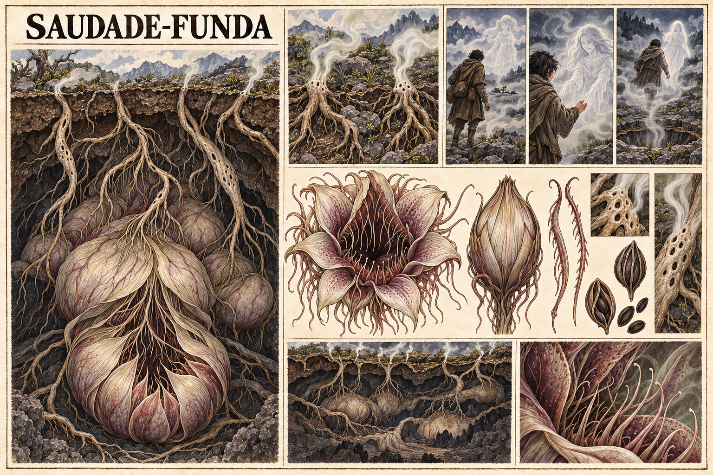

# Saudade-Funda — concept art v1

> **Status:** referência visual canônica. A espécie, o nome Saudade-Funda, o mecanismo de caça e a aparência desta versão foram aprovados pelo autor.

## Conceito estabelecido

Trata-se de uma planta carnívora mágica de tamanho colossal, cujo corpo principal permanece escondido no subsolo. Suas raízes se estendem sob a terra e alcançam a superfície, por onde liberam uma névoa entorpecente.

A névoa atua de duas maneiras simultâneas:

- **química:** entorpece a vítima, reduzindo sua percepção e capacidade de reação;
- **mágica:** produz a ilusão de alguém especial para aquela pessoa.

A aparição atrai a vítima para perto da planta. Quando o viajante se aproxima o bastante, é capturado e devorado. Pessoas desatentas são presas especialmente fáceis.

## Aparência canônica

- corpo central formado por grandes bulbos subterrâneos;
- flor-boca de pétalas carnosas, sem rosto animal ou humano;
- raízes claras com poros que funcionam como respiradouros da névoa;
- acesso à boca oculto em cavernas, fendas ou depressões do terreno;
- coloração em marfim, violeta machucado e vinho apagado;
- ilusão translúcida formada pela própria névoa.

## Pontos em aberto

- alcance, duração e concentração da névoa;
- como a magia descobre quem é especial para cada vítima;
- se várias pessoas enxergam ilusões diferentes ao mesmo tempo;
- sinais que permitem detectar a planta antes da exposição;
- velocidade e método exato de captura;
- reprodução, ciclo de vida e distribuição em Valedorn;
- resistências, antídotos e formas seguras de combatê-la.

## Direção visual usada

Prancha botânica de horror em pergaminho, tinta e aquarela, com corte transversal do subsolo, anatomia da flor e sequência de emboscada. A imagem foi gerada com o gerador de imagens integrado, usando as pranchas do Gira-Lua e da Raiz-de-brasa como referências de linguagem visual.
