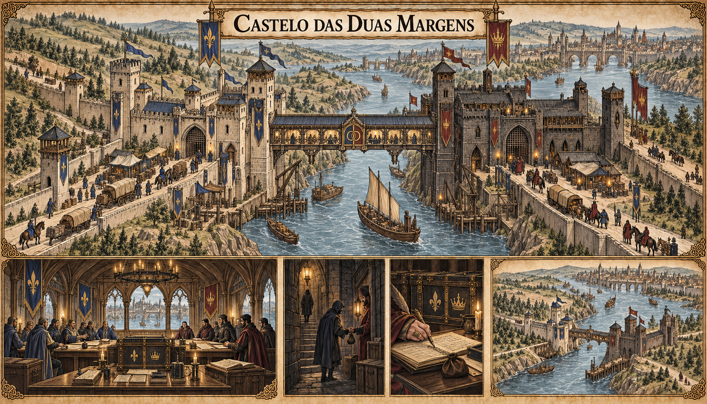

# Castelo das Duas Margens — concept art v1

**Estado:** referência visual canônica aprovada pelo autor.

## Conceito estabelecido

As Duas Margens são uma guilda conjunta de Valedorn e Kharvann, ligada a Ponte-Régia. Prestam escolta comercial, coletam informações e controlam a passagem na fronteira. A organização é profundamente corrupta e funciona à base de propinas.

## Arquitetura canônica

A prancha imagina uma sede fora dos limites urbanos, separada da Ponte das Duas Coroas: duas alas fortificadas, uma em cada margem, unidas por uma travessia reservada. Cada lado conserva sua identidade política na fachada, mas ambos dividem a administração interna. Pátios de inspeção, acomodações de escolta e salas de registros sustentam a imagem pública de serviço fronteiriço. Pequenos gestos de suborno e manipulação de livros mostram o funcionamento real sem torná-lo um espetáculo aberto.

As duas alas em margens opostas, a travessia privativa, os pátios de inspeção e a administração compartilhada são canônicos. A ponte distante representa a Ponte das Duas Coroas já estabelecida no [mapa urbano de Ponte-Régia](../../../../mapa/valedorn/ponte-regia/ponte-regia-mapa-urbano-v1.md); a travessia menor pertence à sede e não substitui a ponte da cidade. Brasões nacionais incidentais e a distribuição completa dos aposentos não são definidos pela imagem.

## Funcionamento dramático

A mesma guilda pode vender proteção a uma caravana e, em segredo, vender sua rota a um concorrente. Registros alfandegários são alterados mediante pagamento para fazer cargas ou viajantes desaparecerem dos livros. A participação direta das Duas Margens no comércio clandestino de pedra de Ânima e tecnologia de selos ainda não foi estabelecida.

Ver [guildas de Valedorn](../../../../../docs/guildas/valedorn.md).
