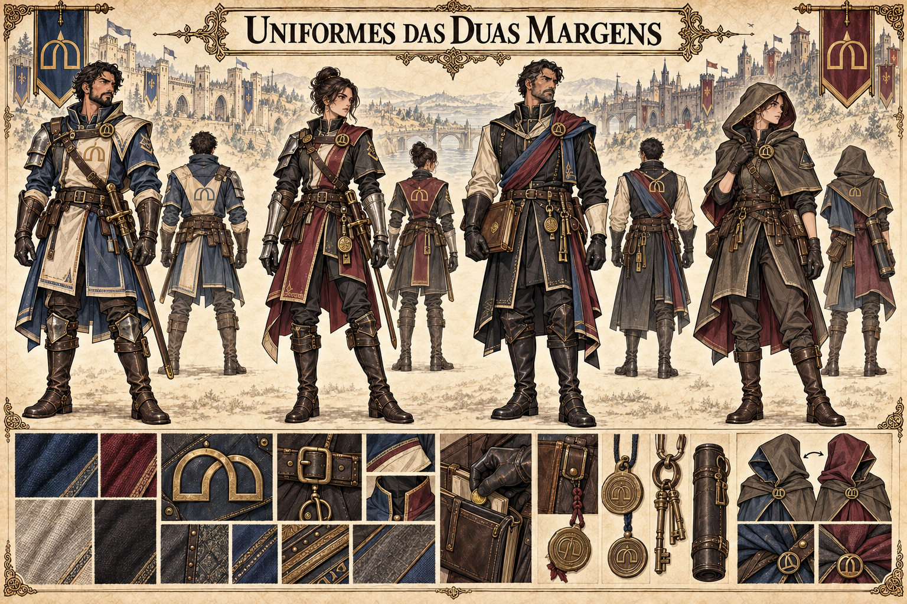

# Uniformes das Duas Margens — concept art v1

**Estado:** referência visual canônica aprovada pelo autor.

## Identidade visual canônica

Quatro variações mostram escolta do lado de Valedorn, guarda de fronteira do lado de Kharvann, agente de fiscalização e mensageira discreta. O corte das roupas e o fecho de dois arcos interligados formam uma identidade comum; azul e marfim distinguem a ala valedorniana, enquanto vinho escuro e carvão sugerem a kharvanniana. O agente de fiscalização combina os dois acentos, e a mensageira pode ocultá-los sob uma capa reversível.

Casacos ajustados, botas de viagem, proteção localizada, bolsas de documentos, lacres e chaves enfatizam inspeção, circulação e controle de acesso. A moeda deslizando para a bolsa de registros sugere propina sem fazer do suborno parte ostensiva do uniforme.

## Limites da canonização

As quatro figuras não são personagens específicos nem estabelecem patentes. O emblema de dois arcos, a paleta binacional, as peças reversíveis e a linguagem de equipamentos são canônicos. As cores e símbolos não definem brasões nacionais de Valedorn ou Kharvann. A participação direta das Duas Margens no comércio secreto de pedra de Ânima e selos continua em aberto.

Ver [guildas de Valedorn](../../../../../docs/guildas/valedorn.md) e [proposta do castelo](castelo-duas-margens-v1.md).
