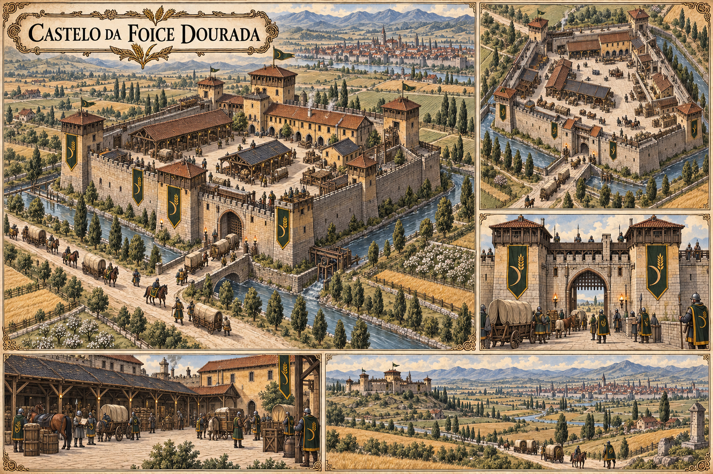

# Castelo da Foice Dourada — concept art v1

> **Status:** referência visual canônica aprovada pelo autor. A arquitetura geral, a identidade e os principais setores operacionais da fortaleza estão estabelecidos.

## Arquitetura canônica

Uma fortaleza de trabalho no Vale de Aurivela: bem mantida, próspera e preparada para escoltar comboios, mas menor e menos monumental que a sede do Último Bastião. Em vez de exibir poder cerimonial, sua planta prioriza circulação de carroças, animais e patrulhas.

- muralhas baixas e espessas, com torres quadradas de observação;
- portaria larga e pátio onde comboios podem entrar, manobrar e ser inspecionados;
- coberturas para carga, estábulos, alojamentos e oficinas de manutenção;
- canal de irrigação aproveitado como obstáculo defensivo;
- pedra clara, reboco ocre, madeira e telhas de barro;
- estandartes verde-escuros com dourado e motivo de foice e espiga;
- posição exterior a Campodouro, com campos e estrada entre o castelo e as muralhas urbanas.

Os depósitos mostrados são instalações operacionais da guilda, não substituem nem duplicam os **Celeiros da Coroa** dentro de Campodouro. O número exato de construções menores e a distância precisa até Campodouro podem variar.

## Leitura narrativa

O castelo protege a produção do vale, mas também permite que a guilda reúna e escolte os comboios tributários que seguem para sustentar a ocupação do sul. A arquitetura expressa essa dupla função sem determinar ainda a opinião dos membros sobre os impostos.

## Direção visual usada

Prancha arquitetônica em pergaminho, tinta e aquarela, com panorama, vista aérea, portaria, pátio de comboios e distância até Campodouro. Gerada com o criador de imagens integrado, usando o mapa canônico de Campodouro como referência geográfica e o castelo do Último Bastião apenas como contraste de escala e recursos.
