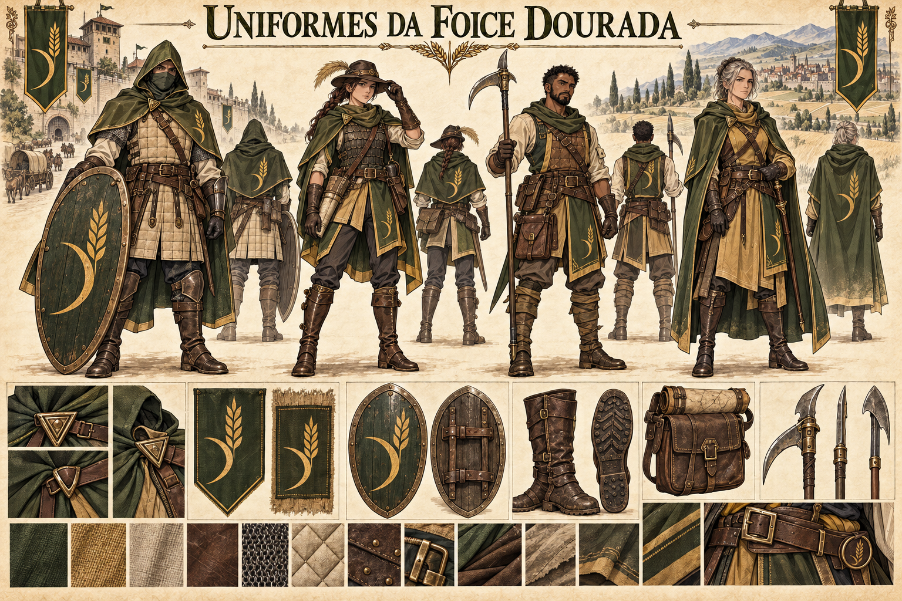

# Uniformes da Foice Dourada — concept art v1

> **Status:** referência visual canônica aprovada pelo autor. Paleta, emblema e linguagem funcional distinguem a Foice Dourada do Último Bastião.

## Direção canônica

Uma guilda profissional de patrulha e escolta no Vale de Aurivela. A roupa deve funcionar em estradas empoeiradas, canais, campos, chuva e longas jornadas junto a carroças e montarias. A coesão vem das capas, da paleta e do emblema, **não** de uma progressão de armadura por domínio de Ânima como no Último Bastião.

## Variações funcionais da prancha

- **Guarda de comboio:** manta com capuz, proteção acolchoada, escudo oval e peças localizadas de metal.
- **Batedora de estrada:** capa curta dividida, chapéu baixo, couro lamelar, botas de montaria e bolsa de mapas.
- **Patrulheiro dos campos e canais:** mangas práticas, proteção leve, bolsa utilitária e arma de haste com gancho.
- **Liderança de campo:** manto longo resistente ao tempo, couro reforçado e roupa adequada para comandar a pé ou a cavalo.

Essas designações descrevem as figuras da prancha; não estabelecem divisões oficiais nem personagens específicos.

## Identidade visual canônica

- verde-oliva, ocre de palha, castanho-terra e bronze envelhecido;
- mantos de viagem sobre túnicas de tecido grosso e couro mantido em bom estado;
- fechos triangulares, cintos largos, botas de sola resistente e bolsas úteis;
- espiga dourada acompanhada de uma pequena foice curva em escudos e capas;
- silhuetas leves, preparadas para escolta e patrulha, sem elmos fechados ou armaduras cerimoniais completas.

## Diferença em relação ao Último Bastião

O Último Bastião propõe placas brilhantes, casacas militares e distinção de patente pela redução progressiva do metal. A Foice Dourada propõe vestuário modular de viagem, proteção por tarefa e variação de equipamento conforme o terreno. A diferença é institucional, não um sinal de menor competência.

## Pontos ainda em aberto

- critérios de promoção e subdivisões administrativas;
- peças obrigatórias em missão e fora de serviço;
- armas regulamentares e eventual uso de Ânima;
- diferenças de inverno, colheita e campanha longa.

## Direção visual usada

Prancha de trajes em pergaminho, com vistas frontais e posteriores, detalhes de capa, escudo, botas, armas e materiais. Gerada com o criador de imagens integrado, usando o Castelo da Foice Dourada como contexto e a prancha do Último Bastião apenas como contraste de linguagem.
