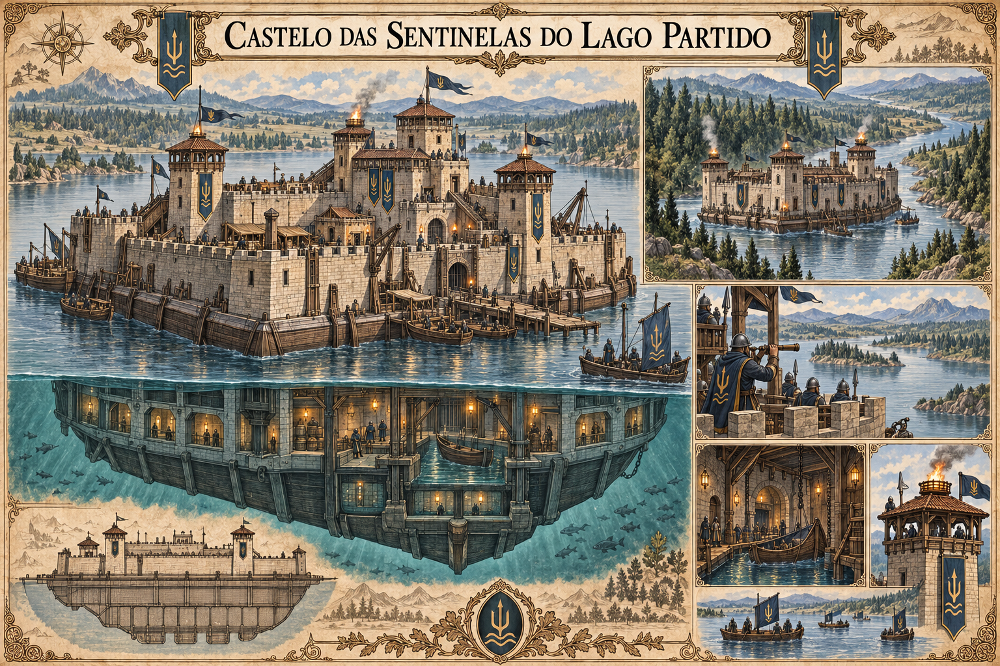

# Castelo das Sentinelas do Lago Partido — concept art v1

**Estado:** referência visual canônica, aprovada pelo autor. A prancha estabelece a arquitetura e a identidade visual da sede, sem transformar enquadramentos ou medidas aparentes em planta técnica.

## Elementos canônicos

- O castelo flutua no Lago Partido e pode subir o rio que desemboca nele.
- Uma parte da fortaleza permanece submersa.
- As Sentinelas vigiam o lago e as fronteiras com Lúmara e Orvena. Sua presença não estabelece domínio de Valedorn sobre o lago inteiro.
- A sede fica no lago, fora de qualquer cidade.
- A fortaleza possui base navegável larga, muralhas de pedra com torres de observação e cais para pequenas embarcações.
- A parte submersa inclui galerias de observação com janelas e uma doca interna protegida; elementos estruturais e de lastro aparecem sob a linha d'água.
- O castelo usa bandeiras azul-escuras com um símbolo dourado de três pontas sobre ondas. Esse é o emblema principal das Sentinelas.

## Leitura da prancha

A composição mostra a fortaleza no lago, um corte da estrutura submersa e sua passagem pelo rio. As vistas menores representam funções e detalhes da mesma sede, não castelos adicionais. O número de figuras, a disposição momentânea dos barcos e a distância aparente entre margens são recursos da ilustração.

## Em aberto

Como a fortaleza flutua e vence a correnteza, suas medidas, seus limites de navegação, a planta interna completa e as regras de patrulha entre jurisdições.

Ver [guildas de Valedorn](../../../../../docs/guildas/valedorn.md) e [geografia do Lago Partido](../../../../../docs/mapa-e-geografia.md).
