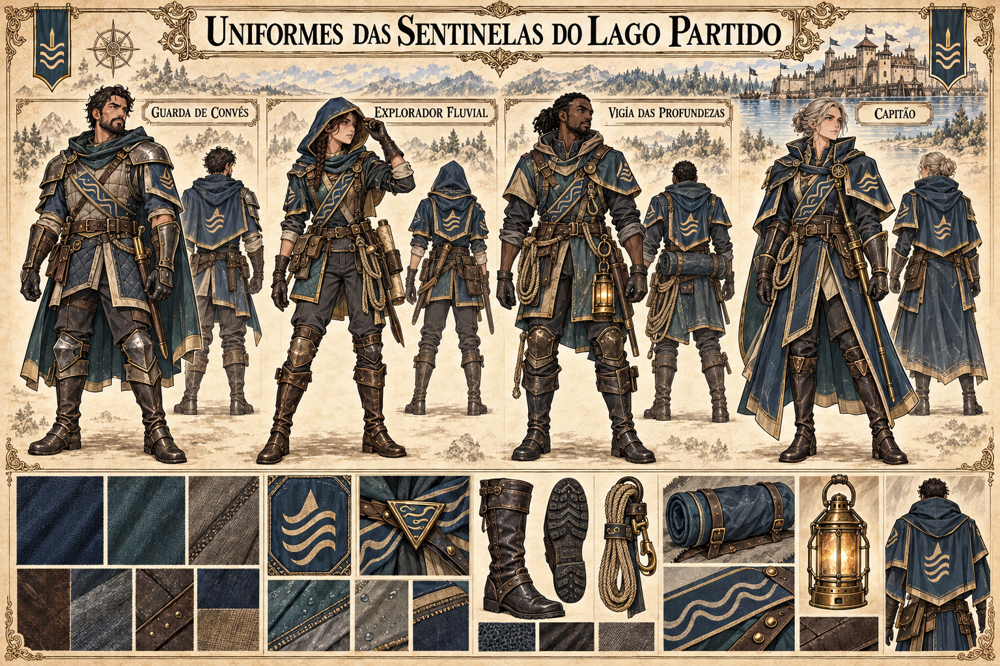

# Uniformes das Sentinelas do Lago Partido — concept art v1

**Estado:** referência visual canônica, aprovada pelo autor. Os quatro trajes são variações funcionais da guilda, não retratos de integrantes específicos nem uma escala de patentes.

## Elementos canônicos

Quatro variações funcionais para trabalho no castelo flutuante e em suas embarcações: guarda de convés, exploração fluvial, vigilância da estrutura submersa e comando. Elas compartilham azul-petróleo, tons de lago, ferragens de latão envelhecido, faixas com linhas de correnteza e capas curtas ou presas ao corpo. O símbolo de ondas nos tecidos é a forma simplificada do emblema de três pontas sobre ondas visto nas bandeiras da fortaleza. Botas com solado aderente, cordas, lanternas e bolsas mantêm a silhueta preparada para superfícies molhadas e barcos estreitos.

As funções retratadas **não estabelecem uma hierarquia de patentes**. A pessoa que vigia a estrutura submersa opera nos espaços internos da fortaleza; a imagem não estabelece respiração debaixo d'água, magia aquática nem tecnologia de mergulho. As figuras ilustradas não são personagens nomeados.

## Em aberto

Composição exata dos tecidos, tratamento de impermeabilização, armamentos específicos e variações visuais entre Remador, Vigia, Sondador, Timoneiro e Comandante do Lago. Os acabamentos podem variar sem perder a silhueta e a identidade estabelecidas.

Ver [guildas de Valedorn](../../../../../docs/guildas/valedorn.md) e [castelo das Sentinelas](castelo-sentinelas-lago-partido-v1.md).
