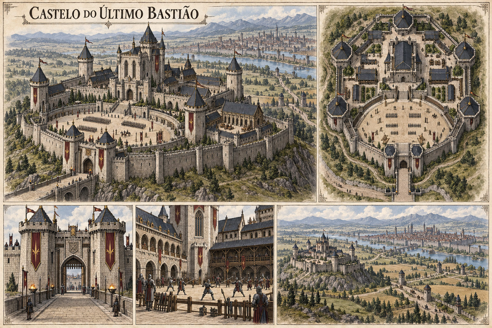

# Castelo do Último Bastião — concept art v1

> **Status:** referência visual canônica aprovada pelo autor. A prancha estabelece a aparência geral da sede; quantidades incidentais e a planta em escala continuam flexíveis.

## Elementos estabelecidos

- sede da guilda Último Bastião;
- situado fora dos limites urbanos de Aurivela;
- maior e mais imponente que o castelo da Vigília do Corvo;
- muito bem conservado e abastecido, refletindo o prestígio e os recursos da guilda mais forte do reino.

## Elementos visuais canônicos

- complexo semelhante a uma pequena cidadela militar;
- cantaria clara bem conservada e telhados de ardósia azul-escura;
- seis torres defensivas principais ao redor de uma torre de menagem central;
- muralhas largas, portaria monumental e estrada fortificada;
- grande pátio semicircular para formação, treino e cerimônias;
- pátios internos, alojamentos, estábulos e edifícios de serviço organizados;
- estandartes em vinho e dourado;
- Aurivela visível à distância, além de campos, rios e estradas.

As seis torres e o pátio semicircular fazem uma referência discreta aos seis instrumentos e ao Coreto do Fim de Edras, interpretada pela população apenas como tradição militar.

Edifícios menores, armas carregadas por figuras de escala e detalhes sem identificação podem variar sem alterar o cânone.

## Pontos em aberto

- nome próprio do castelo, caso seja diferente do nome da guilda;
- distância exata até as muralhas de Aurivela;
- época de construção e reformas;
- distribuição interna além dos setores visíveis;
- capacidade da guarnição e número de membros residentes;
- defesas rúnicas ou ligação institucional com a Academia Militar;
- significado histórico completo do brasão de seis linhas.

## Direção visual usada

Prancha arquitetônica em pergaminho, tinta e aquarela, com panorama, planta aérea, portaria, pátio de treino e relação geográfica com Aurivela. A imagem foi gerada com o gerador integrado, usando o Solar da Vigília como contraste de escala e conservação e o mapa urbano de Aurivela como referência territorial.
