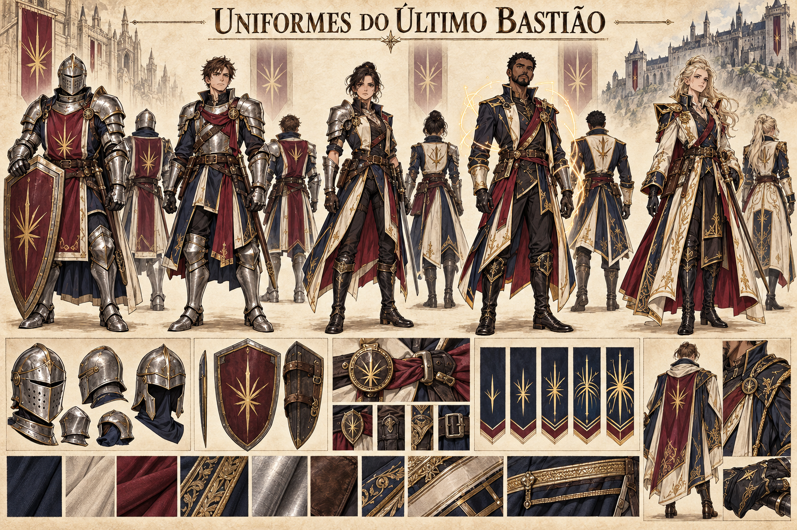

# Uniformes do Último Bastião — concept art v1

> **Status:** referência visual canônica aprovada pelo autor. Os cinco trajes estabelecem uma progressão visual por domínio de Ânima, mas seus nomes abaixo não fixam patentes administrativas.

## Princípio estabelecido

No Último Bastião, o uniforme evidencia a relação entre experiência, domínio de Ânima e proteção física:

- integrantes menos proficientes em Ânima dependem de armaduras mais completas;
- conforme o domínio aumenta, a proteção metálica diminui e a mobilidade cresce;
- os membros mais fortes possuem roupas mais individualizadas, sem perder a identidade coletiva da guilda.

## Progressão visual canônica

Os cinco estágios correspondem às patentes canônicas, com variações individuais possíveis dentro de cada uma.

1. **Escudo Novo:** armadura completa bem conservada, elmo fechado disponível, escudo grande, camada acolchoada e tabardo.
2. **Bastião:** armadura de três quartos, elmo aberto e casaco reforçado, equilibrando resistência e mobilidade.
3. **Muralha:** meia-armadura, uma ombreira dominante, braçadeiras e casaca longa apropriada para movimento rápido.
4. **Pilar:** quase nenhuma placa no torso, casaca militar assimétrica, luvas e botas reforçadas; linhas discretas de Ânima substituem parte da defesa física.
5. **Primeiro Bastião:** casaca longa de presença marcante, sem armadura pesada, corte individual e materiais superiores, mas pronta para combate.

## Coesão visual canônica

- azul profundo, marfim, vinho e dourado fosco em todos os níveis;
- aço claro e impecavelmente mantido nas patentes blindadas;
- golas altas e linhas angulares nos ombros;
- faixa vinho cruzando ou marcando o torso;
- botas escuras, fechos redondos e acabamento dourado;
- brasão inspirado num bastião de seis linhas, repetido no peito, cinto, capa ou escudo;
- assimetria crescente nas patentes superiores, evocando discretamente a memória visual de Edras.

## Limites da canonização

- as cinco figuras não são personagens definidos;
- gênero, origem e aparência não determinam patente;
- armas incidentais na prancha não criam armamentos obrigatórios;
- funções administrativas secundárias e critérios de promoção permanecem em aberto.

## Direção visual usada

Prancha de uniformes em pergaminho, com cinco silhuetas em progressão, vistas posteriores, elmos, escudo, fechos, insígnias e materiais. A imagem foi gerada com o gerador integrado, usando Edras como referência histórica indireta e o Castelo do Último Bastião como referência institucional.
