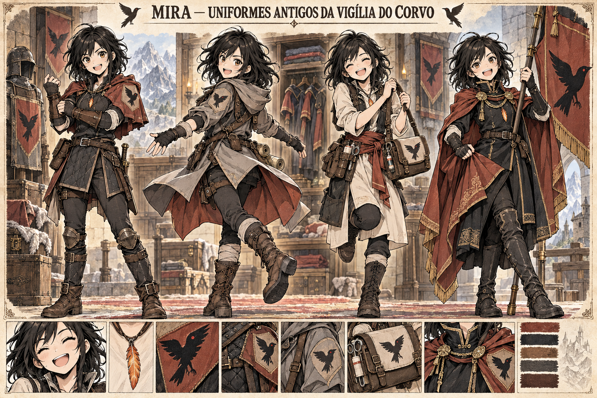

# Mira experimenta os uniformes antigos da Vigília — concept art v1

**Estado:** referência visual canônica e cena futura estabelecida. O momento exato da cronologia permanece a definir.

## Leitura da prancha

Mira experimenta, feliz e curiosa, quatro uniformes preservados da época em que a Vigília do Corvo tinha mais recursos. Os trajes estão íntegros e bem cuidados, em contraste com a situação precária atual da guilda. As quatro variações imaginam serviço de muralha, reconhecimento de trilhas, atendimento de campo e representação cerimonial. São soluções distintas de silhueta, não uma progressão de patentes.

O motivo comum é um **corvo negro de asas abertas**, às vezes com pequeno olho vermelho, sobre tecido vermelho-terroso ou claro. Ele representa a guilda e deve ser distinguido da Fênix de Aelyra e do pingente de pena herdado por Mira. A paleta combina cinza de montanha, carvão, marfim e vermelho-terroso. Cada figura é a mesma Mira, mantendo cabelos negros rebeldes, olhos âmbar, corpo compacto e atlético e seu pingente.

## Limites da canonização

Os quatro conjuntos sobreviveram preservados e Mira os experimentará numa cena futura. Suas linguagens de muralha, trilha, atendimento e cerimônia, a paleta e o corvo negro de asas abertas são canônicos. Os nomes históricos dos cargos e o momento exato da cena permanecem em aberto. A imagem não confirma uma reforma da guilda nem que Mira ocupe todos esses cargos. O estandarte cerimonial não é um artefato mágico.

Ver [Mira](../../../../../docs/personagens/guilda-vigilia-do-corvo/mira.md) e [guildas de Valedorn](../../../../../docs/guildas/valedorn.md).
