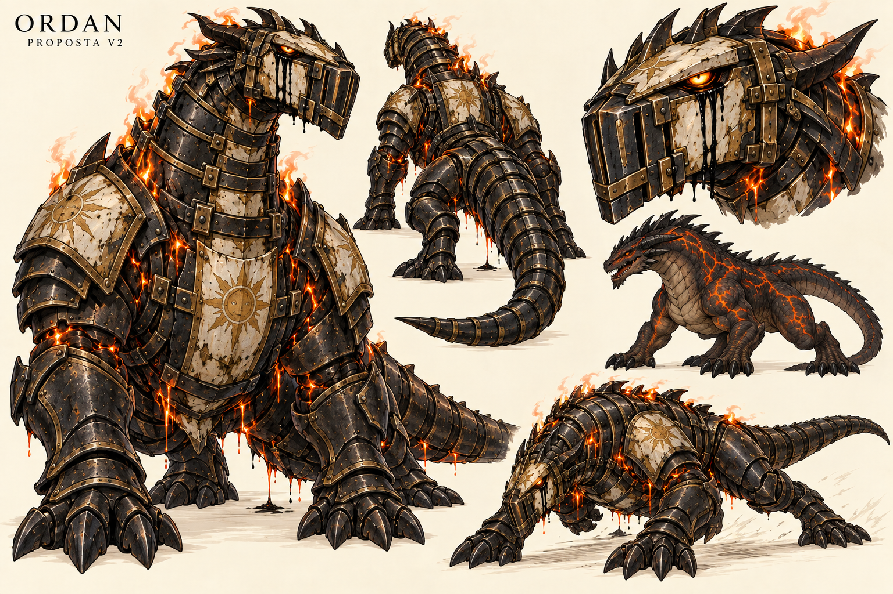

# Ordan — versão 2

> **Status:** histórico; a anatomia quadrúpede e monumental foi substituída pela versão 3 bípede e esguia. O nome Ordan permanece aprovado.

A referência canônica vigente está em [Ordan — versão 4](ordan-v4.md).

## Descrição

Prancha de um drake quadrúpede sem asas, com vista frontal em três quartos, costas, detalhe do elmo, estudo da criatura sem armadura e pose de investida. A armadura-prisão conserva a paleta negra, marfim queimado e ouro gasto da versão anterior. Lágrimas negras escorrem dos olhos, enquanto fogo e lava escapam por aberturas distintas.

## Elementos estabelecidos

- Ordan foi leal ao Deus da Luz antes de ser corrompido pela loucura.
- Tornou-se uma arma selvagem contida numa armadura quase totalmente fechada.
- A armadura vaza fogo e lava.
- Está aprisionado na capital de Valedorn.

## Proposta vigente

- Drake: dragão quadrúpede sem asas e sem vestígios de asas.
- Lágrimas negras como manifestação visual da loucura.
- Título **Fornalha Cativa**.
- Anatomia, proporções, símbolos solares e construção da armadura apresentados nesta prancha.

## Elementos proibidos ou não canônicos

- Não acrescentar asas, plumagem, traços de fênix ou postura humanoide.
- Não confundir lágrimas negras com sangue, fogo negro ou lava.
- A forma sem armadura é estudo visual; sua libertação ainda não foi estabelecida.
- Textos além do nome e do status da proposta não fazem parte do cânone.

## Inspeção visual

A silhueta é monumental e inequívoca como dragão sem asas. Peito, pescoço, quatro apoios e cauda mantêm leitura de criatura de cerco. As lágrimas negras têm origem nos olhos e permanecem distintas da lava alaranjada. Fogo superior e lava descendente possuem origens claras nas juntas. A construção geral se repete entre as vistas, embora a disposição exata de travas, espinhos e placas ainda precise ser padronizada antes de uso sequencial. O detalhe de cabeça mostra apenas um lado do rosto; uma futura folha de modelo pode fixar a simetria dos canais lacrimais.

## Produção

Gerada com a ferramenta integrada de imagem a partir da versão 1 como referência visual. A versão anterior foi preservada.

[Ficha de Ordan](../../../../../../docs/personagens/grandes-generais/luz/general-drake.md).

## Prompt utilizado

Use case: precise-object-edit
Asset type: character concept art sheet for the original colored medieval high-magic shonen manga Ligados pela Chama
Input image: edit target and visual continuity reference; preserve the professional ivory concept-sheet presentation, blackened restraint armor, worn ivory-and-gold remnants of the God of Light, visible locks, heat leaks, and the name ORDan.
Primary request: redesign Ordan from a bipedal fire salamander into a far more imposing wingless drake, a true dragon without wings. He was once a loyal divine general of the God of Light, was consumed by madness, became a savage living weapon, and is trapped in almost entirely closed containment armor in the capital of Valedorn.
Subject: colossal quadrupedal wingless drake with a huge armored chest, long powerful neck, broad wedge-shaped draconic head, four massive clawed limbs, and a long thick armored tail. He must read unmistakably as a dragon, not a salamander, dinosaur, human knight, or wyvern. No wings and no wing stumps. Mostly horizontal bestial posture, capable of charging like a siege beast. The smaller unarmored study must show dark volcanic scales, heavy horned brow, short crown horns and cheek spines, glowing lava fissures, and a dignified ancient draconic anatomy ruined by madness.
Armor: retain the prior blackened iron, scorched ivory enamel and worn gold solar insignia, but rebuild it around quadrupedal drake anatomy. Armor encloses roughly 95 percent of the body, including an elongated muzzle cage, sealed neck rings, massive shoulder and chest plates, armored legs, and overlapping tail segments. Heavy external locking bars and arcane restraint clamps clearly make it a mobile prison. Medieval divine containment, never science-fiction machinery.
Critical madness symbol: both glowing amber eyes remain visible through narrow openings. Thick supernatural black tears continuously flow from both eyes, visibly emerging from the eye sockets, running down carved drainage channels in the helmet and staining the ivory armor below. The tears are glossy pitch-black liquid, visually distinct from soot, shadow, blood, lava and fire. Make this readable in the large main view and especially clear in the head closeup. Expression is pain and feral rage, not sadness.
Fire behavior: controlled orange fire escapes upward only from shoulder, neck and dorsal vents. Small streams of molten lava leak downward from belly and joint seams and form black cooled crust. Keep a clear physical origin for every leak. Do not obscure the silhouette with flames.
Composition: landscape concept sheet on warm ivory background. Large full-body front three-quarter view dominates the left; smaller matching rear view in the center; large helmet/head closeup in the upper right emphasizing the black tears; smaller unarmored wingless drake anatomy study; dynamic low charging pose in the lower right. All silhouettes complete and uncropped with clear spacing.
Style/medium: clean expressive manga ink, polished rich color, readable simplified shapes suitable for later sequential comics; slightly less surface noise than the source image; not photorealistic and not 3D.
Text verbatim: "ORDAN" and small subtitle "PROPOSTA V2" only.
Constraints: preserve Ordan's name, the concept of an armored living prison, the black/ivory/old-gold palette, sun symbols, fire and lava leaks. Show consistent armor construction across front, rear and action poses; coherent four-legged anatomy and claws.
Avoid: wings, feathers, phoenix traits, humanoid torso, standing upright like a person, salamander skin, rounded amphibian snout, weapons, extra characters, scenery, lore paragraphs, measurements, modern technology, excessive flames, red tears, black fire, gore, watermark.
