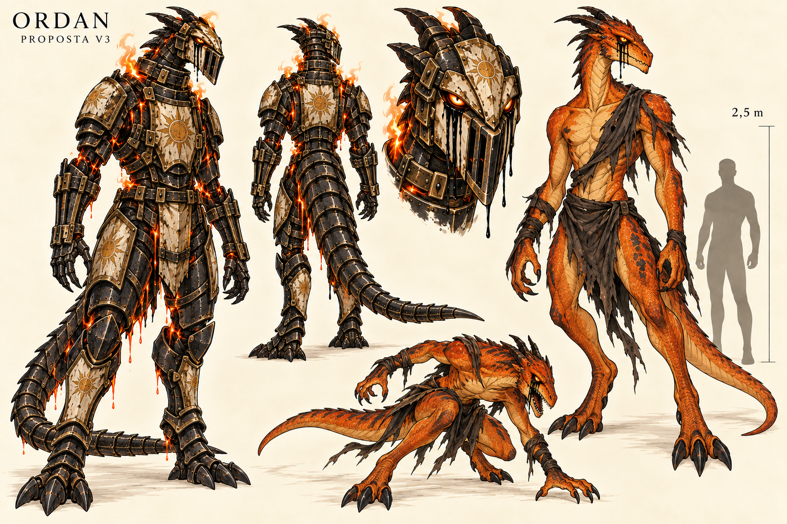

# Ordan — versão 3

> **Status:** versão histórica anteriormente canônica, substituída pela versão 4.

A referência visual canônica vigente está na [versão 4](ordan-v4.md).

## Descrição

Prancha de Ordan como drake bípede de aproximadamente 2,5 metros, esguio e com anatomia intermediária entre humano e besta. A forma livre possui escamas laranja, pernas digitígradas, braços longos, cabeça dracônica e trapos escuros. A forma contida usa uma armadura-prisão estreita de ferro negro, marfim queimado e ouro gasto.

## Elementos estabelecidos pelo autor

- Nome Ordan.
- Título **Fornalha Infernal**.
- Drake sem asas, bípede e esguio, com cerca de 2,5 metros.
- Corpo laranja e anatomia intermediária entre humano e besta.
- Quando está sem armadura, veste trapos.
- Antigo general leal ao Deus da Luz, corrompido pela loucura.
- Lágrimas negras saem dos olhos como sinal da loucura.
- Tornou-se uma arma selvagem contida numa armadura quase totalmente fechada.
- A armadura vaza fogo e lava; Ordan está aprisionado na capital de Valedorn.
- Sua chama é a mais quente que já existiu.

## Elementos visuais canônicos

- Tons de laranja queimado, ventre âmbar e marcas vermelho-escuras.
- Chifres curtos voltados para trás e cauda longa para equilíbrio.
- Trapos atravessando um ombro, o torso e a cintura.
- Placas de contenção ajustadas ao corpo, com símbolos solares desgastados.

## Elementos proibidos ou não canônicos

- Não acrescentar asas, vestígios de asas, plumagem ou traços de fênix.
- Não torná-lo quadrúpede, gigantesco, excessivamente musculoso ou semelhante a um humano com máscara.
- Não confundir as lágrimas negras com sangue, lava ou fogo negro.
- A forma livre é um estudo visual; sua libertação ainda não foi estabelecida na história.

## Inspeção visual

A altura e a silhueta esguia estão claras na comparação de escala. Cabeça, cauda, garras e pernas digitígradas preservam a natureza bestial; peito, braços e postura sustentam o aspecto humanoide. As lágrimas negras aparecem com clareza nas formas contida e livre. Os trapos têm continuidade temática, embora a disposição exata precise ser fixada numa futura folha de modelo. A armadura segue o corpo sem recuperar o volume pesado da versão 2. Fogo e lava continuam legíveis, mas algumas frestas alaranjadas podem exigir simplificação nas páginas para não serem confundidas com pele exposta.

## Produção

Gerada com a ferramenta integrada de imagem usando a versão 2 como referência. As versões anteriores foram preservadas.

[Ficha de Ordan](../../../../../../docs/personagens/grandes-generais/luz/general-drake.md).

## Prompt utilizado

Use case: precise-object-edit
Asset type: character concept art sheet for the original colored medieval high-magic shonen manga Ligados pela Chama
Input image: Ordan version 2 is the edit target and continuity reference. Preserve only the name, wingless drake identity, black tears, blackened restraint armor with worn ivory-and-gold solar remnants, and separate fire/lava leaks. Redesign anatomy, proportions, stance and armor silhouette as specified.
Primary request: redesign Ordan as a slender orange bipedal wingless drake approximately 2.5 meters tall, visually halfway between a humanoid person and a feral beast. He is an ancient divine general formerly loyal to the God of Light, consumed by madness and contained as a savage weapon inside nearly closed armor in the capital of Valedorn.
Subject anatomy: upright bipedal drake with a narrow athletic torso, long arms ending in expressive four-fingered claws, long digitigrade legs, a long balancing tail, elongated draconic head, short swept-back horns, narrow waist and powerful but lean musculature. Height and proportions feel around 2.5 meters, tall rather than gigantic. Shoulders moderately broad, never bulky. Humanlike ability to stand and gesture, but predatory posture, forward neck and animal head make him clearly bestial. No wings and no wing stumps.
Unarmored form: saturated burnt-orange scales with a lighter amber chest and belly, subtle darker red-orange markings, glowing gold-orange eyes, black supernatural tears flowing from both eyes. Sparse scorched cloth rags remain as clothing: torn dark wrap around waist and upper thighs, ragged diagonal remnant across part of torso, a few shredded strips at one shoulder and forearms. The rags look ancient, practical and ruined, never fashionable robes or full clothing. Show a haunted trace of intelligence under feral madness.
Armored form: nearly fully enclosed restraint armor adapted to the same slender bipedal anatomy. Blackened iron plates fit closely along the long body without turning him into a bulky knight. Narrow sealed helmet follows the long draconic muzzle; eye openings and carved tear channels visibly allow pitch-black tears to flow outside. External locks and restraint bars cross chest, neck, forearms and shins. Small scorched ivory plates and worn gold sun emblems show former loyalty to the God of Light. Tail protected by articulated overlapping plates. Leave small gaps only at joints and vents.
Critical visual distinction: orange is the dominant body color in the unarmored study. Black tears originate clearly at both eyes and are distinct from soot, blood, shadow, fire and lava. Orange fire escapes upward from limited neck and shoulder vents. Small bright molten lava leaks downward from armor joints and forms dark cooled crust. Keep effects controlled and silhouettes clean.
Composition: professional landscape concept sheet on warm ivory background. Large armored full-body front three-quarter standing pose on left, fully visible head to feet and tail. Smaller armored rear view near center. Large front-facing helmet closeup showing both eyes and both black tear trails. Large unarmored full-body study on right clearly showing orange scales and torn rags. Smaller dynamic feral crouch or lunging pose. Add a simple neutral human scale silhouette next to the unarmored form with a clean 2.5 m height marker. All views uncropped and separated.
Style/medium: polished colored manga character design, strong clean expressive ink, readable shapes, moderate detail suitable for sequential comics, original medieval high fantasy, not photorealistic and not 3D.
Text verbatim: "ORDAN", "PROPOSTA V3", and "2,5 m" only.
Constraints: Ordan must be bipedal and slender in every view; consistent horns, tail, limbs and armor construction; anatomy between humanoid and beast; armor remains an obvious prison; no weapons and no additional characters except the featureless scale silhouette.
Avoid: quadrupedal stance, giant kaiju proportions, broad bodybuilder torso, thick stocky limbs, salamander anatomy, human face, human skin, wings, feathers, phoenix traits, sci-fi robot armor, fashionable intact clothing, cape, excessive fabric, excessive flames, black fire, red tears, gore, scenery, paragraphs, watermark.
