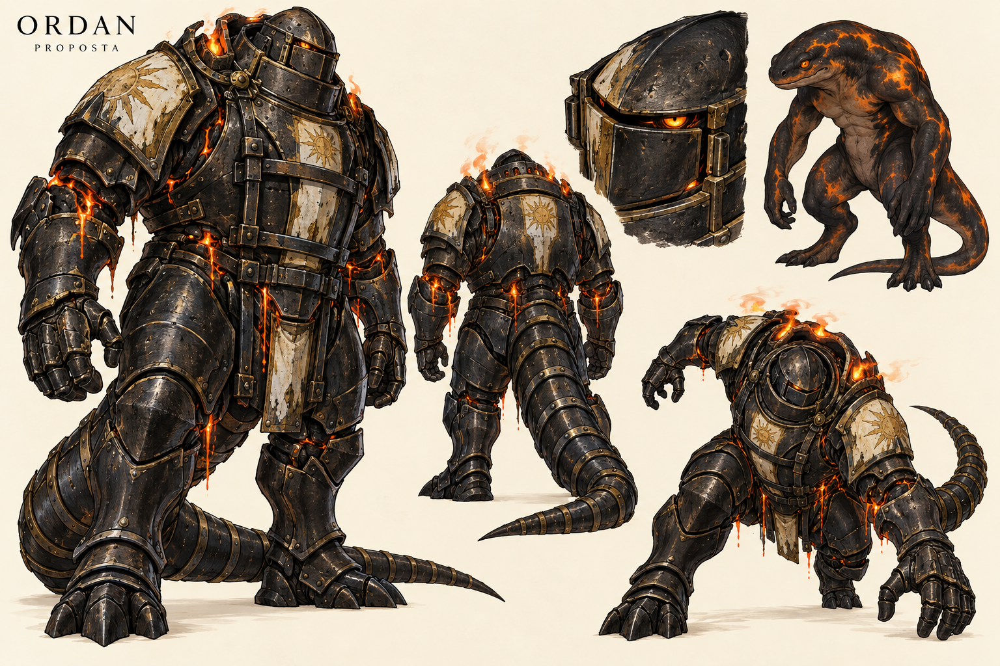

# General salamandra — versão 1

> **Status:** histórico; conceito de salamandra substituído pela proposta de drake na versão 2. O nome Ordan foi aprovado.

A referência canônica vigente está em [Ordan — versão 4](../general-drake/ordan-v4.md).

## Descrição

Prancha com vista frontal em três quartos, costas, detalhe do elmo, estudo da criatura sem armadura e pose de avanço. Armadura negra de contenção, marfim queimado, ouro gasto, fogo e lava alaranjados. Cauda longa protegida por segmentos metálicos.

## Elementos obrigatórios

- Salamandra de fogo, antigo general leal ao Deus da Luz, corrompido pela loucura.
- Armadura quase inteiramente fechada contendo uma arma selvagem.
- Fogo e lava escapando de aberturas fisicamente identificáveis.
- Prisão na capital de Valedorn, não representada nesta prancha.

## Propostas e elementos não canônicos

- Nome, título, bipedalismo, cauda revestida, símbolos, materiais e proporções são propostas.
- A forma sem armadura é estudo de design, não uma libertação estabelecida na história.
- Nenhuma escala ou origem da armadura foi definida.
- Evitar asas, plumagem, chifres dracônicos e aparência de robô tecnológico.

## Inspeção visual

Silhuetas completas e legíveis; fogo superior e lava descendente possuem origem nas juntas. Mãos e apoios não apresentam defeitos anatômicos evidentes na prancha. Frente e costas preservam a estrutura geral, mas fechos, dedos e placas precisam de padronização antes de uso sequencial. O acabamento é mais texturizado e pesado que o traço da referência de Aelyra; simplificar texturas em uma adaptação para páginas. Elmo mais humano que o focinho do estudo interno: revisar o volume interno ao consolidar a anatomia.

## Produção

Gerada com a ferramenta integrada de imagem. Primeira versão, sem substituir artes anteriores.

[Ficha do personagem](../../../../../../docs/personagens/grandes-generais/luz/general-salamandra.md).

## Prompt utilizado

Create a polished landscape character concept art sheet for original colored medieval high-magic shonen manga Ligados pela Chama. Proposed character Ordan, a divine fire salamander formerly loyal to the God of Light, driven insane and now a savage weapon imprisoned inside almost entirely closed restraint armor, held captive in the capital of Valedorn. ONLY character design on warm ivory background, no scene, no lore paragraphs, no text except small title 'ORDAN' and subtitle 'PROPOSTA'. Main large full body front three-quarter view on left, matching smaller full body rear view middle, helmet closeup and small unarmored anatomical salamander study upper right, dynamic braced lunging armored pose lower right. Strong clean expressive ink lines and rich colored manga shading, finely crafted readable armor, not photorealistic, not 3D. Character bulky hunched bipedal amphibian creature with low broad rounded salamander snout, thick neck, powerful limbs, long thick tapering salamander tail. Anatomical study has charcoal smooth amphibian skin with glowing orange patches, no dragon horns wings or scales. Armor encloses 95 percent of body including face hands feet and tail: large blackened iron plates, heavy external locking bars over breastplate, sealed collar, few scorched ivory enamel panels and worn old gold sun motif remnants indicating fallen divine allegiance. Tail encased in overlapping articulated metal rings. Helmet low blunt and nearly sealed, small narrow slit with one furious living amber eye visible in closeup, no human face. Fire vents upward through narrow shoulder/back gaps; small molten orange lava streams leak downward from elbow and lower torso seams forming cooled black crust, source physically clear. Preserve huge quiet dark metal areas so the silhouette remains readable, no wall of fire. Broad armored hands with coherent digits, articulated joints and consistent design front/back/action. A creature painfully constrained and straining inside a mobile prison, medieval arcane restraints not science fiction robotics. No weapons, no feathers, no halo, no invented biography, no heights, no additional characters. Cohesive professional concept sheet with full silhouettes uncropped and ample spacing.
