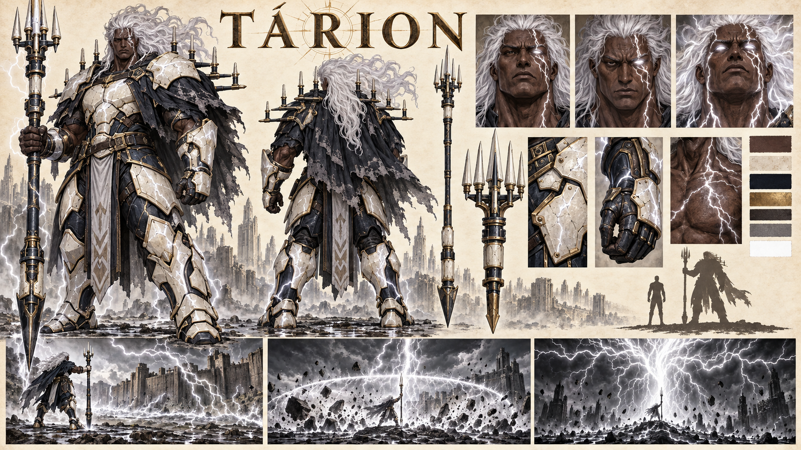

# Tárion, o Trovão Branco — concept art v1

> **Status:** versão histórica substituída. A arma de múltiplas pontas foi descartada em favor da alabarda da versão 2.

## Prévia e intenção

Prancha horizontal de Tárion, general morto da Luz e colosso de artilharia responsável por conduzir tempestades entre céu e terra. Mostra vistas frontal e traseira, três estados do rosto, olhos, cicatrizes, armadura, Haste do Primeiro Relâmpago, escala e três manifestações da Condução do Primeiro Céu.

## Elementos representados

- Homem adulto colossal, com aproximadamente 2,35 metros, corpo massivo e postura imóvel.
- Pele castanha muito escura, rosto severo sem barba e cabelos longos e brancos elevados pela carga.
- Cicatrizes brancas ramificadas atravessando um dos olhos, rosto, pescoço e peito.
- Estado normal com olhar escuro e estado de condução com olhos completamente brancos.
- Armadura pesada de cerâmica marfim sobre metal azul-noturno, com rachaduras luminosas, couro escuro e detalhes discretos de ouro.
- Manto curto preto e cinza, rasgado e semelhante a uma massa de chuva carregada.
- Conjunto horizontal de pequenos para-raios nos ombros e nas costas, formando uma coroa baixa.
- **Haste do Primeiro Relâmpago** maior que Tárion, construída com metal escuro, segmentos de cerâmica e uma cabeça de múltiplos condutores.
- Comparação de escala com humano adulto comum.
- Cena de preparação com marcas elétricas ramificadas espalhando-se pelo terreno.
- Cena de descarga acompanhada por uma grande frente circular de pressão e destroços.
- Manifestação do Trovão Branco em imagem quase monocromática, conectando céu, haste, corpo e solo.

## Inspeção visual

- Frente e costas preservam proporções, cabelo, armadura, manto, paleta e estrutura dos condutores.
- A massa do corpo e a base ampla dos pés comunicam imobilidade e resistência, sem pose de velocista.
- A cerâmica marfim possui rachaduras e superfícies vitrificadas visualmente distintas da pedra negra de Dargan e da armadura de Ordan.
- O rosto continua humano, maduro e severo, sem barba, elmo, chifres ou traços animais.
- Os três retratos mantêm a mesma identidade enquanto mostram carga crescente e perda de sensibilidade.
- A Haste ultrapassa a altura de Tárion e possui ponta inferior robusta para ser fincada no solo.
- As vinhetas deixam a origem da descarga legível: céu, haste, corpo e terreno formam um único circuito.
- O painel final desatura o mundo e mantém apenas a árvore de relâmpagos brancos como elemento dominante.
- As mãos visíveis possuem anatomia legível e contato claro com a haste.
- `TÁRION` é o único texto alfabético intencional da prancha.

## Limites da leitura

- A concept art representa a cabeça da Haste com cinco grandes pontas visíveis, enquanto a ficha propõe sete. A quantidade exata dos condutores permanece em aberto e não deve ser inferida desta versão.
- A estrutura dos ombros contém mais de sete pequenas pontas aparentes. Elas formam um sistema condutor contínuo; o número exato de para-raios também continua a definir.
- A cabeça da Haste se aproxima visualmente de um tridente ou forcado, mas sua função proposta é a de ferramenta de cerco e para-raios.
- A cidade em ruínas e a fortificação das vinhetas são cenários anônimos e não estabelecem o lugar da morte de Tárion.
- A roupa sob a armadura inclui painéis com grafismos abstratos. Eles não representam runas, letras ou símbolos canônicos.
- Aparência, armadura, arma e manifestações só se tornam canônicas após aprovação do autor.

## Elementos proibidos ou não canônicos

- A antiga Haste do Primeiro Relâmpago foi substituída e não pertence ao design vigente.
- Tárion não usa martelo, arma de fogo, tecnologia, armadura futurista ou símbolo moderno de raio.
- Não é um velocista e não depende de corrida para produzir suas técnicas.
- Não possui barba, capacete, asas, chifres ou anatomia monstruosa.
- O relâmpago principal é branco; azul e amarelo não devem substituir sua identidade cromática.
- As ruínas não representam Aurivela, a Muralha de Cinza ou outra cidade estabelecida.
- A cena não confirma que Dargan matou Tárion; essa relação permanece como proposta textual.

## Prompt final

Concept sheet horizontal de Tárion, o Trovão Branco: Grande General masculino morto da Luz, colosso de artilharia imóvel, adulto de 2,35 metros, corpo massivo, pele castanha muito escura, rosto severo sem barba, cabelos longos e brancos elevados pela carga, cicatrizes brancas ramificadas e olhos totalmente brancos durante a condução. Armadura pesada de cerâmica marfim rachada sobre metal azul-noturno, manto curto de chuva e para-raios nos ombros. Haste do Primeiro Relâmpago maior que ele, como ferramenta de cerco fincada no chão. Mostrar frente, costas, três rostos, olhos, armadura, arma, paleta, escala e vinhetas da Cicatriz do Céu, Voz da Tempestade e Trovão Branco. Poder branco desatura o cenário e conecta céu, corpo e solo. Sem martelo, velocista, estética viking, barba, capacete, tecnologia, texto biográfico ou marca-d'água. Apenas o título `TÁRION`.

## Ficha relacionada

- [Tárion, o Trovão Branco](../../../../../../docs/personagens/grandes-generais/luz/tarion.md)
